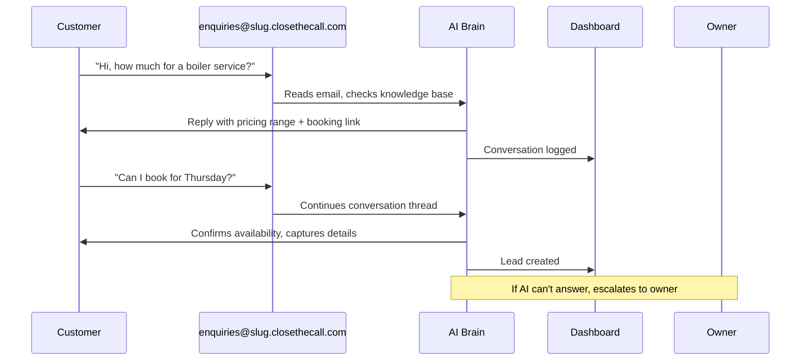

Your AI receptionist can answer customer emails using the same knowledge base and personality it uses on phone calls and text messages. Customers email your AI address, and the AI sends a helpful reply that lands in their normal inbox -- no login required, no special app.

## How It Works



The customer sees replies from your business email address in their normal inbox (Gmail, Outlook, Apple Mail, etc). They reply as they would to any email. The conversation continues naturally.

## Setup

<Steps>
  <Step title="Go to AI Config">
    Navigate to **AI Config** in the sidebar, or go to [app.closethecall.com/ai-config](https://app.closethecall.com/ai-config).
  </Step>
  <Step title="Find the AI Email Replies card">
    Scroll to the **AI Email Replies** section.
  </Step>
  <Step title="Toggle it ON">
    Flip the switch to enable AI email replies.
  </Step>
  <Step title="Copy your AI email address">
    Your unique address is auto-generated: `enquiries@yourslug.closethecall.com`. Copy it.
  </Step>
  <Step title="Put it on your website">
    Add this email address to your website's contact page, footer, or "Email Us" button. Customers who email it will get AI-powered replies.
  </Step>
</Steps>

### The Settings Card

```
+----------------------------------------------------------+
| AI Email Replies                                    [ON] |
|                                                          |
| Your AI email address:                                   |
| enquiries@fasttrack-repairs.closethecall.com   [Copy]    |
|                                                          |
| Put this address on your website. Customers who email    |
| it will get AI-powered replies using your knowledge      |
| base.                                                    |
|                                                          |
| All email conversations appear in your Conversations     |
| page alongside SMS and WhatsApp.                         |
+----------------------------------------------------------+
```

## What the AI Can Do via Email

The AI uses the same capabilities as phone and text:

| Capability | Example |
|-----------|---------|
| **Answer FAQs** | "What are your opening hours?" -- AI replies with your hours from the knowledge base. |
| **Give price ranges** | "How much for a rewire?" -- AI responds with your configured pricing range and disclaimer. |
| **Book appointments** | "Can I book for next Tuesday?" -- AI checks availability and books the slot. |
| **Capture leads** | Customer provides name, phone, or describes a job -- AI creates a lead in your dashboard. |
| **Escalate to you** | "I need to speak to someone about a complaint" -- AI escalates and you're notified. |

## Safety Features

AI email replies include multiple safeguards to prevent spam, loops, and unwanted behaviour.

### Anti-Spam Filters

The AI ignores emails from:
- **noreply@** addresses
- **Newsletter** senders and mailing lists
- **Auto-reply** and out-of-office messages
- **Bounce notifications** and delivery status messages
- Addresses flagged as spam by the email provider

### Anti-Loop Protection

Email loops (where two auto-responders keep replying to each other) are prevented by three mechanisms:

| Protection | Rule |
|-----------|------|
| **Per-sender rate limit** | Maximum 1 AI reply per email address per hour. |
| **Per-thread limit** | Maximum 3 AI replies per email thread. After that, the conversation is escalated to you. |
| **Header detection** | The AI checks for auto-reply headers (`X-Auto-Response-Suppress`, `Auto-Submitted`) and skips them. |

### Escalation

If the AI cannot confidently answer an email, it escalates to you rather than sending a bad reply. You receive:
- An SMS alert: "Customer email needs your attention"
- An email with a link to the conversation in your dashboard

The customer does not receive a reply until you respond manually or hand it back to the AI.

## Where Customers See Replies

Replies come from your business email address and land in the customer's normal inbox. There is nothing special about the experience from the customer's perspective -- it looks and feels like emailing a real person.

- **Gmail users** see it in their inbox
- **Outlook users** see it in their inbox
- **Apple Mail users** see it in their inbox
- Thread grouping works normally (replies stay in the same thread)

## Where You See Conversations

All email conversations appear in your [Conversations page](https://app.closethecall.com/conversations) alongside SMS, WhatsApp, and Web Chat. Filter by **Email** to see only email threads.

You can:
- Read the full thread
- Take over and reply manually (human takeover)
- Escalate to a team member
- View the customer's lead profile in the right panel

<Accordion title="Can I use my own domain email instead of closethecall.com?">
  Not yet. The AI email address uses the `closethecall.com` domain. Custom domain support is on the roadmap.
</Accordion>

<Accordion title="Does the AI reply to every email?">
  No. It skips auto-replies, newsletters, noreply addresses, and spam. It also respects rate limits (1 reply per sender per hour, 3 per thread) to prevent loops.
</Accordion>

<Accordion title="What if I want to reply to an email myself?">
  Open the conversation in your dashboard and type your reply. This triggers human takeover -- the AI pauses auto-replies for that thread. Click **Resume AI** when you're done.
</Accordion>

<Accordion title="Do email conversations create leads?">
  Yes. If the customer provides their name, phone, or describes a service they need, a lead is created automatically -- just like with phone calls and SMS.
</Accordion>
