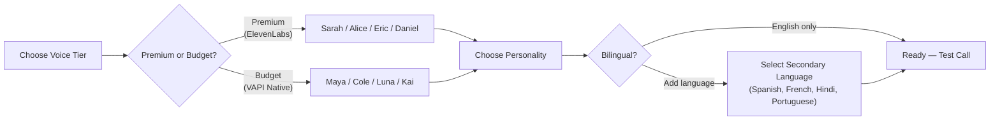

## Your AI receptionist's voice matters

The voice your callers hear sets the tone for your entire business. A warm, natural voice builds trust. A robotic voice makes people hang up. We offer two tiers of voices so you can pick the right balance of quality and cost.

## Premium voices (ElevenLabs)

These are our highest-quality voices. They sound almost indistinguishable from a real person — natural pauses, breathing, and emotion. Powered by ElevenLabs, the industry leader in AI voice.

<CardGroup cols={2}>
  <Card title="Sarah" icon="user">
    **Female - Warm & Professional**

    A calm, friendly voice with a neutral accent. The most popular choice for service businesses. Great for dental practices, salons, and professional services.
  </Card>
  <Card title="Alice" icon="user">
    **Female - Bright & Energetic**

    A lively, upbeat voice that sounds enthusiastic without being over the top. Works well for restaurants, fitness studios, and retail.
  </Card>
  <Card title="Eric" icon="user-tie">
    **Male - Confident & Clear**

    A strong, reassuring voice with clear diction. Popular with trades (plumbing, HVAC, electrical) and automotive businesses.
  </Card>
  <Card title="Daniel" icon="user-tie">
    **Male - Calm & Authoritative**

    A smooth, measured voice that conveys expertise. Good for legal, financial, and medical practices.
  </Card>
</CardGroup>

## Budget voices (VAPI)

These voices cost roughly **6x less per minute** than premium voices ($0.0025/min vs standard ElevenLabs rates). They are still good quality — clearly AI, but perfectly understandable. A smart choice if you handle high call volumes and want to keep costs down.

<CardGroup cols={2}>
  <Card title="Maya" icon="user">
    **Female - Friendly & Clear**

    A pleasant voice for everyday business calls. Good all-rounder.
  </Card>
  <Card title="Cole" icon="user-tie">
    **Male - Straightforward**

    A direct, no-nonsense male voice. Works for trades and service businesses.
  </Card>
  <Card title="Luna" icon="user">
    **Female - Soft & Calm**

    A gentle voice that puts callers at ease. Good for healthcare and wellness.
  </Card>
  <Card title="Kai" icon="user-tie">
    **Male - Warm & Approachable**

    A friendly male voice with a conversational tone.
  </Card>
</CardGroup>

## Premium vs budget: when to use each

| | Premium (ElevenLabs) | Budget (VAPI) |
|---|---|---|
| **Sound quality** | Near-human, natural breathing and pauses | Good, clearly AI but understandable |
| **Cost** | Standard rate (included in your plan minutes) | ~6x cheaper per minute ($0.0025/min) |
| **Best for** | Customer-facing businesses where first impressions matter | High-volume calls, internal routing, after-hours overflow |
| **Recommended for** | Salons, dental, restaurants, professional services | Trades with high call volume, secondary lines |

<Tip>
If you are unsure, start with a premium voice. You can always switch to a budget voice later if you want to save on minutes — it takes one click.
</Tip>

## How to change your voice

<Steps>
  <Step title="Go to Receptionist Settings">
    Click **Receptionist** in the left sidebar of your [dashboard](https://app.closethecall.com/ai-config).
  </Step>
  <Step title="Find the Voice section">
    Scroll down to the **Voice** card. You will see your currently selected voice.
  </Step>
  <Step title="Play samples">
    Click the **play** button next to each voice name to hear a sample. Listen to a few before deciding. (Play buttons are available for premium voices with audio samples.)
  </Step>
  <Step title="Select your voice">
    Click the voice you want. Your selection is saved automatically.
  </Step>
  <Step title="Test it">
    Go to **Test AI** in the sidebar and make a test call to hear your new voice in action with your actual greeting and business information.
  </Step>
</Steps>

<Info>
Voice changes take effect on the next incoming call. Any call already in progress will continue with the previous voice.
</Info>

## Tips for choosing the right voice

- **Match your brand.** A plumber does not need to sound like a luxury spa, and a dental practice does not need to sound like a building site.
- **Think about your callers.** If most of your customers are elderly, a calm, clear voice (Sarah or Daniel) works best. Younger audiences might prefer the energy of Alice.
- **Listen on a phone.** Voices sound different through a phone speaker than through your computer. Test by calling your AI number from your mobile.
- **Ask a friend.** Have someone who does not know it is AI call your number and get their honest reaction.

<Warning>
Changing your voice does not affect your greeting message, personality, or any other settings. It only changes how the AI sounds.
</Warning>

## Frequently Asked Questions

<AccordionGroup>
  <Accordion title="Can I preview voices before choosing?">
    Yes. Premium ElevenLabs voices have a play button next to each name on the Receptionist Settings page. Click it to hear a short sample. You can also make a test call from the Test AI page to hear the voice with your actual greeting and business information.
  </Accordion>
  <Accordion title="Does changing my voice affect my greeting?">
    No. Your greeting message, personality, knowledge base, and all other settings stay exactly the same. Only the sound of the voice changes. Sarah reading your greeting sounds different from Eric, but the words are identical.
  </Accordion>
  <Accordion title="Which voice works best for UK accents?">
    All ElevenLabs voices handle UK English naturally — they adapt to the context of your business. **Sarah** and **Daniel** are the most popular choices for UK businesses. The ElevenLabs multilingual v2 model supports British English natively, so there is no American accent issue.
  </Accordion>
  <Accordion title="What's the cost difference between premium and budget voices?">
    VAPI native voices (Maya, Cole, Luna, Kai) cost approximately **$0.0025 per minute** — roughly 6x cheaper than ElevenLabs premium voices. Both are included in your plan, but budget voices use fewer of your included minutes. If you are on a high-volume plan and want to stretch your minutes further, budget voices are a smart choice.
  </Accordion>
</AccordionGroup>
