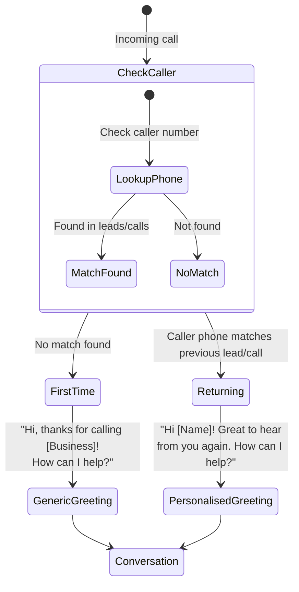

## Why your greeting matters

Your greeting is the very first thing a caller hears. You have about 3 seconds to make them feel they have called the right place. A good greeting does three things:

1. **Confirms the business name** (so the caller knows they dialled correctly)
2. **Sounds welcoming** (not robotic or rushed)
3. **Asks a question** (moves the conversation forward)

## Good vs bad greetings

<CardGroup cols={2}>
  <Card title="Good greeting" icon="check">
    "Hi, thanks for calling Dave's Plumbing! How can I help you today?"

    **Why it works:** Short, confirms the business, asks an open question.
  </Card>
  <Card title="Bad greeting" icon="xmark">
    "Thank you for calling Dave's Plumbing Services Limited, a family-owned business established in 1987 serving the greater Manchester area. Your call is important to us. Please note that calls may be recorded for training and quality purposes. How may I direct your call today?"

    **Why it fails:** Way too long. Caller zones out or hangs up before it ends.
  </Card>
</CardGroup>

<Tip>
Keep your greeting under 15 words. The caller wants help, not a company history lesson.
</Tip>

## Industry templates

Here are proven greetings for common business types. Feel free to copy and tweak these:

<Accordion title="Plumbing / HVAC / Electrical">
**Standard:**
"Hi, thanks for calling [Business Name]! Do you need to book a repair or have a question?"

**After hours:**
"Hi, you've reached [Business Name]. We're closed right now but I can take your details and have someone call you back first thing. What's the issue?"

**Emergency-focused:**
"Hi, thanks for calling [Business Name]! Is this an emergency or would you like to book an appointment?"
</Accordion>

<Accordion title="Hair & Beauty Salon">
**Standard:**
"Hey, thanks for calling [Business Name]! Are you looking to book an appointment?"

**With personality:**
"Hi there! Welcome to [Business Name]. Would you like to book in for a treatment?"

**Returning client:**
"Hi [Name]! Great to hear from you again. Would you like to book your usual appointment?"
</Accordion>

<Accordion title="Dental Practice">
**Standard:**
"Good morning, [Practice Name]. Are you an existing patient or would you like to register?"

**Friendly:**
"Hi, thanks for calling [Practice Name]! How can we help you today?"

**Urgent:**
"Hi, thanks for calling [Practice Name]. Are you calling about a dental emergency or would you like to book a check-up?"
</Accordion>

<Accordion title="Restaurant">
**Standard:**
"Hi, thanks for calling [Restaurant Name]! Would you like to make a reservation?"

**Casual:**
"Hey! Thanks for calling [Restaurant Name]. Table booking, takeaway, or a question?"

**With hours:**
"Hi, thanks for calling [Restaurant Name]! We're open until 10pm tonight. Would you like to book a table?"
</Accordion>

<Accordion title="HVAC / Heating">
**Standard:**
"Hi, thanks for calling [Business Name]! Do you need a repair, a service, or a quote?"

**Seasonal:**
"Hi, thanks for calling [Business Name]! Are you calling about your heating or air conditioning?"

**Emergency:**
"Hi, thanks for calling [Business Name]! Is your heating or cooling down right now, or is this for a routine service?"
</Accordion>

## After-Hours Greeting

You can set a separate message for calls that come in outside your business hours. When **After Hours** is enabled in your Phone settings:

- The AI uses your **after-hours message** instead of the standard greeting
- You can include an optional **forwarding number** for emergencies
- The AI still captures leads and takes messages — callers are not turned away

To configure after-hours:
1. Go to **Phone** in the sidebar
2. Toggle **After Hours** on
3. Enter your after-hours message (e.g., "We're closed right now but I can take your details...")
4. Optionally add an emergency forwarding number

## How to set your greeting

<Steps>
  <Step title="Go to Receptionist Settings">
    Click **Receptionist** in the left sidebar of your [dashboard](https://app.closethecall.com/ai-config).
  </Step>
  <Step title="Find the Greeting section">
    At the top of the page, you will see the **Greeting Message** text box with your current greeting.
  </Step>
  <Step title="Type your new greeting">
    Delete the existing text and type your new greeting. Remember: short, friendly, ends with a question.
  </Step>
  <Step title="Click Save">
    Click the **Save** button. Your new greeting is live on the next call.
  </Step>
</Steps>

## Personalised greetings for returning callers

When someone who has called before rings your number, the AI can greet them by name. For example:

> "Hi Sarah! Great to hear from you again. How can I help you today?"

This happens automatically. The AI checks its records for the caller's phone number, finds their name from a previous call, and personalises the greeting. You do not need to turn anything on — it works out of the box.

<Info>
Personalised greetings only work when the caller's number matches a previous lead or call record. First-time callers always hear your standard greeting.
</Info>

## Tips for better greetings

- **Say your business name** — callers need to know they reached the right place
- **End with a question** — this prompts the caller to speak and keeps the conversation moving
- **Avoid jargon** — "How can I direct your call?" is corporate speak. "How can I help?" is human
- **Skip the legal disclaimers** — recording notices and disclaimers can be handled separately via the TCPA setting
- **Test it yourself** — call your AI number after changing the greeting to hear how it sounds

<Warning>
If your greeting is too long (over 30 words), callers may start talking over the AI, which confuses the conversation. Keep it short.
</Warning>

## Frequently Asked Questions

<AccordionGroup>
  <Accordion title="Can I have different greetings for different times?">
    Yes. You can set a standard greeting for business hours and a separate **after-hours message** in the Phone settings. The AI automatically switches between them based on your configured business hours. You cannot set different greetings for specific days of the week beyond the hours/after-hours split.
  </Accordion>
  <Accordion title="Does the greeting use my minutes?">
    Yes. The greeting is part of the call, so it counts toward your plan minutes. This is why keeping it short (under 15 words) is important — a 5-second greeting vs a 30-second greeting adds up over hundreds of calls.
  </Accordion>
  <Accordion title="Can I greet callers in another language?">
    Yes. If you enable **Bilingual Mode** in Receptionist Settings and select a secondary language (Spanish, French, Hindi, or Portuguese), the AI can detect the caller's language and switch automatically. The greeting starts in English, but the AI responds in the caller's preferred language.
  </Accordion>
  <Accordion title="What's the ideal greeting length?">
    **Under 15 words** is the sweet spot. This takes about 3-5 seconds to say, which is short enough that callers do not zone out or start talking over the AI. The greeting should confirm your business name, sound welcoming, and end with an open question.
  </Accordion>
</AccordionGroup>
