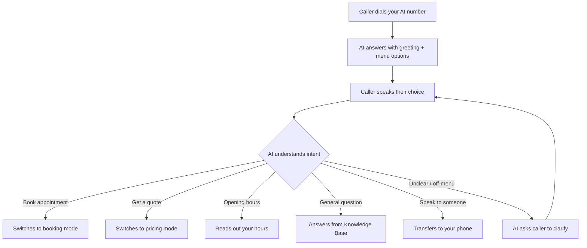

## What is the IVR Phone Menu?

IVR stands for Interactive Voice Response — the "press 1 for sales, press 2 for support" system you hear when calling big companies. Our IVR is different: **callers speak instead of pressing buttons.**

When enabled, your AI receptionist greets the caller and offers a short menu of options. The caller simply says what they need, and the AI routes them to the right response.

> "Hi, thanks for calling Dave's Plumbing! I can help with booking an appointment, getting a price quote, checking our opening hours, or connecting you with Dave directly. What would you like?"

The caller says "I need a price quote" and the AI immediately switches to pricing mode.

## How the IVR flow works



## Why voice-based IVR?

<CardGroup cols={2}>
  <Card title="No button pressing" icon="hand-pointer">
    Callers hate pressing buttons, especially on mobile. Voice is natural and faster.
  </Card>
  <Card title="Smarter routing" icon="brain">
    The AI understands intent, not just numbers. "I need help with my boiler" routes correctly even if the caller does not use your exact menu wording.
  </Card>
  <Card title="Fewer wrong transfers" icon="arrow-right-arrow-left">
    Callers pick the option that matches their needs, not a random guess at which number to press.
  </Card>
  <Card title="Professional image" icon="building">
    A voice menu makes a small business sound established and organised, without the robotic feel of traditional IVR.
  </Card>
</CardGroup>

## How to set up your IVR menu

<Steps>
  <Step title="Go to Receptionist Settings">
    Click **Receptionist** in the left sidebar.
  </Step>
  <Step title="Find the Phone Menu section">
    Scroll to the **IVR Phone Menu** card.
  </Step>
  <Step title="Enable the phone menu">
    Toggle **Phone Menu** on.
  </Step>
  <Step title="Add your menu options">
    Click **Add Option** to create each menu item. For each option, you set:
    - **Label** — what the caller hears (e.g. "Book an appointment")
    - **Action** — what happens when they choose it
  </Step>
  <Step title="Save">
    Click **Save**. Your AI receptionist will start offering the menu on the next call.
  </Step>
</Steps>

## IVR settings in your dashboard

Here is what the IVR Phone Menu card looks like in your Receptionist Settings:

```
+----------------------------------------------------------+
|  IVR Phone Menu                              [Toggle: ON] |
+----------------------------------------------------------+
|                                                          |
|  Menu Options (3 of 5 max)                               |
|                                                          |
|  +----------------------------------------------------+  |
|  | 1. Book an appointment           [Booking]    [x]  |  |
|  +----------------------------------------------------+  |
|  | 2. Get a price quote             [Pricing]    [x]  |  |
|  +----------------------------------------------------+  |
|  | 3. Speak to someone              [Transfer]   [x]  |  |
|  +----------------------------------------------------+  |
|                                                          |
|  [+ Add Option]                                          |
|                                                          |
|  [Save Changes]                                          |
+----------------------------------------------------------+
```

## Menu option actions

Each menu option triggers a specific action:

| Action | What happens | Best for |
|--------|-------------|----------|
| **Booking** | AI switches to appointment booking mode — checks availability, collects details, confirms | Service businesses that take appointments |
| **Pricing** | AI answers pricing questions from your Knowledge Base | Businesses with multiple services at different price points |
| **Hours** | AI tells the caller your opening hours, including today's hours specifically | All businesses |
| **General Info** | AI answers any question using your full Knowledge Base | Catch-all for FAQs and other queries |
| **Transfer** | AI transfers the call to your phone number | When callers need a real person |

## Example menus by industry

<Accordion title="Plumber / Tradesperson">
1. **Book a repair** (Booking)
2. **Get a quote** (Pricing)
3. **Check availability** (Booking)
4. **Speak to someone** (Transfer)
</Accordion>

<Accordion title="Hair Salon">
1. **Book an appointment** (Booking)
2. **Treatment prices** (Pricing)
3. **Opening hours** (Hours)
4. **Speak to the salon** (Transfer)
</Accordion>

<Accordion title="Dental Practice">
1. **Book a check-up** (Booking)
2. **Emergency dental issue** (Transfer)
3. **Treatment information** (General Info)
4. **Opening hours** (Hours)
</Accordion>

<Accordion title="Restaurant">
1. **Book a table** (Booking)
2. **View our menu** (General Info)
3. **Opening hours** (Hours)
4. **Speak to the restaurant** (Transfer)
</Accordion>

## Best practices

<Tip>
**Keep it to 3 to 5 options.** More than 5 and callers forget the first options by the time they hear the last one. Three is ideal.
</Tip>

- **Put the most common option first.** If 80% of your calls are for bookings, make that option number one.
- **Always include a "speak to someone" option.** Some callers will never want to talk to an AI — give them an exit.
- **Use plain language.** Say "Book an appointment" not "Schedule a consultation." Your callers are normal people, not corporate executives.
- **Test the flow yourself.** Call your AI number and try each menu option to make sure they work as expected.

<Warning>
You can have a maximum of 5 menu options. If you need more than 5, combine related items (e.g. "Pricing and services" instead of separate options for each).
</Warning>

## IVR vs no IVR

**Without IVR:** The AI greets the caller and waits for them to say what they need. Works well when most calls are about the same thing (e.g. booking).

**With IVR:** The AI offers structured options upfront. Works better when callers call for many different reasons and you want to guide them efficiently.

<Info>
You can enable or disable the phone menu at any time. Turning it off does not delete your menu options — they are saved and ready if you turn it back on.
</Info>

## Frequently asked questions

<Accordion title="Can I change menu options after going live?">
Yes. Go to **Receptionist Settings**, scroll to the IVR Phone Menu card, and edit, reorder, or remove any option. Changes take effect on the very next call — no restart or redeploy needed.
</Accordion>

<Accordion title="What if the caller says something not on the menu?">
The AI does not hang up or give an error. It uses intent matching — if the caller says something close to one of your options, it routes them there. If the request is genuinely unrelated to any menu item, the AI asks the caller to clarify or falls back to General Info mode to answer from your Knowledge Base.
</Accordion>

<Accordion title="What is the maximum number of menu items?">
You can have up to **5 menu options**. This is a deliberate limit — research shows callers start forgetting options after 4 or 5 items. If you need more coverage, use the **General Info** action as a catch-all for anything not covered by specific options.
</Accordion>

<Accordion title="Can I combine IVR with Smart Routing (Squads)?">
Yes. IVR and Smart Routing work independently. IVR controls what menu the caller hears, while Smart Routing controls which specialised AI assistant handles each topic. When both are enabled, the caller picks a menu option and is routed to the specialist assistant for that topic.
</Accordion>

---

<Card title="Configure your IVR menu now" icon="arrow-up-right-from-square" href="https://app.closethecall.com/ai-config">
  Open your Receptionist Settings to enable and customise your phone menu.
</Card>
