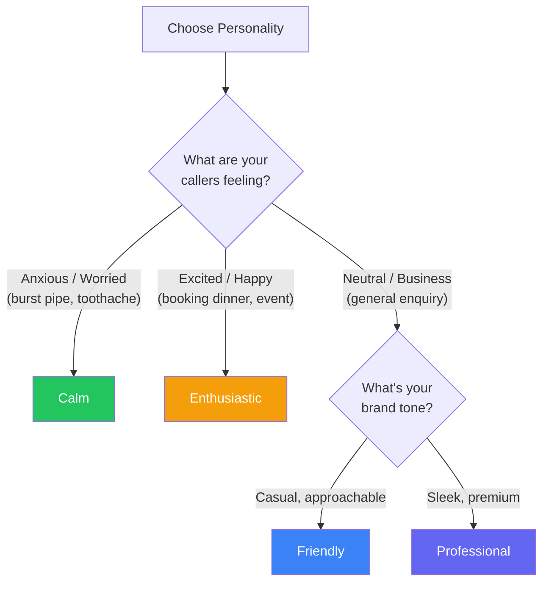

## Your AI's personality shapes every conversation

The personality setting controls the **tone and style** of how your AI receptionist speaks throughout the entire call — not just the greeting, but every response. It affects word choice, energy level, and how formal or casual the AI sounds.

## The 4 personality options

<CardGroup cols={2}>
  <Card title="Professional" icon="briefcase">
    **Best for:** Dental practices, law firms, accountants, medical clinics

    Clear, polished, and businesslike. Uses proper language without being stiff. Gives callers confidence they are dealing with a well-run operation.

    **Example phrases:**
    - "Certainly, I can help you with that."
    - "Let me check our available appointments for you."
    - "I have noted your details and someone will be in touch shortly."
  </Card>
  <Card title="Friendly" icon="hand-wave">
    **Best for:** Plumbers, electricians, salons, general trades

    Warm and approachable. Like talking to a helpful neighbour who happens to work at the business. The most popular choice.

    **Example phrases:**
    - "Sure thing! Let me take a look for you."
    - "No worries at all, I can get that sorted."
    - "Brilliant, I have got you booked in!"
  </Card>
  <Card title="Enthusiastic" icon="star">
    **Best for:** Restaurants, fitness studios, entertainment venues, retail

    High energy and upbeat. Makes callers feel excited about whatever they are booking or asking about. Adds warmth without being unprofessional.

    **Example phrases:**
    - "Oh great, you are going to love it!"
    - "Awesome! Let me grab you a spot."
    - "That is fantastic, we would love to have you!"
  </Card>
  <Card title="Calm" icon="leaf">
    **Best for:** Therapists, spas, wellness centres, veterinary clinics

    Gentle, measured, and reassuring. Speaks at a relaxed pace. Puts anxious or stressed callers at ease. Perfect when callers might be worried or upset.

    **Example phrases:**
    - "Of course, take your time."
    - "I completely understand. Let me help you with that."
    - "No rush at all. I am here to help."
  </Card>
</CardGroup>

## How to choose the right personality

Ask yourself these questions:

1. **What state of mind are my callers in?** If they are panicking about a burst pipe, Calm works. If they are excited about booking a dinner, Enthusiastic works.
2. **What is my brand tone?** Look at your website and social media. If your brand is casual and fun, Friendly matches. If it is sleek and premium, Professional fits.
3. **What would my best receptionist sound like?** Think of the ideal person answering your phone. Pick the personality that matches them.

<Tip>
"Friendly" is the right choice for most small businesses. When in doubt, start there. You can always change it later.
</Tip>

## How to change the personality

<Steps>
  <Step title="Go to Receptionist Settings">
    Click **Receptionist** in the left sidebar of your [dashboard](https://app.closethecall.com/ai-config).
  </Step>
  <Step title="Find the Personality section">
    Scroll to the **Personality** card. You will see four options with your current selection highlighted.
  </Step>
  <Step title="Select a personality">
    Click the personality you want. It highlights immediately.
  </Step>
  <Step title="Click Save">
    Click the **Save** button at the bottom of the section. Your AI receptionist will use the new personality on its next call.
  </Step>
</Steps>

## What personality does NOT change

The personality setting affects tone and word choice. It does **not** change:

- **Your greeting message** — that is set separately
- **Your business information** — the AI always uses your knowledge base for facts
- **What the AI can do** — booking, lead capture, and FAQs work the same regardless of personality
- **The voice** — Sarah sounds like Sarah whether she is Professional or Enthusiastic. Voice and personality are separate settings

<Info>
You can combine any voice with any personality. For example, Eric (a confident male voice) with Calm personality creates a reassuring, authoritative receptionist. Or Alice (a bright female voice) with Professional personality for an energetic but polished feel.
</Info>

## Testing your personality choice

After changing the personality:

1. Call your AI number from your mobile
2. Ask a few different questions (pricing, booking, hours)
3. Listen to how the AI phrases its responses
4. If the tone does not feel right, go back and try a different personality

<Warning>
Personality changes apply to all calls — you cannot set different personalities for different times of day. If you need a calmer tone after hours, consider adjusting your after-hours message instead.
</Warning>

## Frequently Asked Questions

<AccordionGroup>
  <Accordion title="Can I create a custom personality?">
    Not directly through the personality selector, but you can achieve custom tones through the **system prompt** in Receptionist Settings. The 4 preset personalities cover the vast majority of use cases. If you need something very specific (e.g., "speak like a luxury concierge"), contact support and we can help configure a custom prompt.
  </Accordion>
  <Accordion title="Does personality affect all channels?">
    Yes. The personality setting applies to **phone calls**, **SMS/WhatsApp AI replies**, and **web chat widget** conversations. The AI maintains the same tone across all channels so your brand feels consistent no matter how a customer reaches you.
  </Accordion>
  <Accordion title="Can callers tell it's AI?">
    With premium ElevenLabs voices and the right personality, most callers do not realise they are talking to AI — especially on short calls (booking, pricing enquiry). Longer or more complex conversations may reveal it. The "Friendly" and "Calm" personalities tend to sound the most natural.
  </Accordion>
  <Accordion title="Which personality is most popular?">
    **Friendly** is by far the most popular choice, used by over 60% of businesses on CloseTheCall. It works well across almost every industry. **Professional** is the second most common, especially with dental practices, law firms, and financial services.
  </Accordion>
</AccordionGroup>
