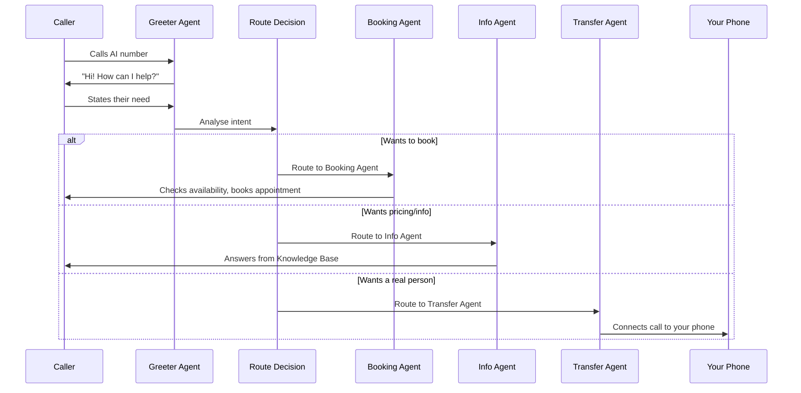

## What are Squads?

A Squad is a team of specialised AI agents that work together on a single call. Instead of one AI trying to do everything, the call gets routed through agents that are each experts at one thing.

Think of it like a real office: the receptionist greets you, the booking manager handles your appointment, the billing team answers price questions, and someone else transfers you to the boss. Squads work the same way — but it is all AI.

## How Squads work

When a caller rings your AI number with Squads enabled, here is what happens:

<Steps>
  <Step title="Greeter picks up">
    The **Greeter agent** answers with your greeting message and asks the caller what they need. This is a quick, friendly interaction — just like a receptionist saying "How can I help?"
  </Step>
  <Step title="Caller is routed">
    Based on what the caller says, they are transferred to the right specialist agent. The handoff is seamless — the caller does not hear any hold music or transfer noises.
  </Step>
  <Step title="Specialist handles the request">
    The specialist agent (booking, pricing, general info, etc.) takes over and handles the conversation using deep knowledge of that specific area.
  </Step>
  <Step title="Transfer to human (if needed)">
    If the caller needs a real person, the Transfer agent connects them to your phone number.
  </Step>
</Steps>

## The Squad agents

| Agent | What it handles | Example caller request |
|-------|----------------|----------------------|
| **Greeter** | Initial welcome, figures out what the caller needs | "Hi, thanks for calling! How can I help?" |
| **Booking Agent** | Appointments, scheduling, availability checks | "I need to book a boiler service" |
| **Info Agent** | Pricing, services, hours, FAQs, policies | "How much does a bathroom fitting cost?" |
| **Transfer Agent** | Connects to a real person when AI cannot help | "I need to speak to the manager" |

## Single mode vs Squad mode

<CardGroup cols={2}>
  <Card title="Single Mode (default)" icon="user">
    **One AI handles everything**

    - Simpler to set up
    - Works well for most small businesses
    - The AI answers greetings, bookings, pricing, and FAQs all in one conversation
    - Can occasionally get confused on complex calls with multiple topics
  </Card>
  <Card title="Squad Mode" icon="users-gear">
    **Specialised agents for each task**

    - Better accuracy on complex calls
    - Less hallucination (each agent focuses on one thing)
    - Faster responses (smaller, focused knowledge per agent)
    - Best for businesses with lots of services or complex booking rules
  </Card>
</CardGroup>

## When should you use Squads?

**Use Squads if:**
- Your business offers many different services (more than 10)
- You have complex booking rules (different appointment types, durations, staff members)
- Callers often ask about multiple topics in one call
- You have noticed the AI occasionally getting confused or giving wrong information

**Stick with Single mode if:**
- Your business is straightforward (one or two services)
- Most calls are simple (book an appointment or ask a quick question)
- You are just getting started and want to keep things simple

<Tip>
Most businesses start with Single mode and switch to Squads later if they notice the AI struggling with complex calls. There is no pressure to use Squads from day one.
</Tip>

## How to enable Squads

<Steps>
  <Step title="Go to Receptionist Settings">
    Click **Receptionist** in the left sidebar of your [dashboard](https://app.closethecall.com/ai-config).
  </Step>
  <Step title="Find the Routing Mode section">
    Scroll to the **Smart Routing** card.
  </Step>
  <Step title="Enable Squad mode">
    Toggle **Squad Mode** on. You will see the list of available agents.
  </Step>
  <Step title="Configure each agent">
    Each agent uses your Knowledge Base automatically. You can customise the handoff phrases if you want (for example, the Greeter's exact wording when transferring to the Booking Agent).
  </Step>
  <Step title="Save and test">
    Click **Save**, then call your AI number to test the flow. Try asking for a booking, then try asking a pricing question — you should notice the handoff between agents.
  </Step>
</Steps>

## Benefits of Squads

- **Less hallucination** — each agent has a focused job, so it is less likely to make things up
- **Faster responses** — agents only load the knowledge they need, so they respond quicker
- **Better accuracy** — the Booking Agent only thinks about bookings, so it does not mix up pricing with scheduling
- **Natural handoffs** — callers experience a smooth transition, just like being transferred to the right department

<Info>
Squads use the same Knowledge Base as Single mode. You do not need to create separate knowledge for each agent — they automatically pull the relevant articles for their speciality.
</Info>

<Warning>
Squads are an advanced feature. If your AI is already handling calls well in Single mode, there is no need to switch. Only enable Squads if you are seeing specific issues with accuracy or complexity.
</Warning>

## Frequently Asked Questions

<AccordionGroup>
  <Accordion title="Do squads use more minutes?">
    Squads use roughly the **same number of minutes** as single mode for equivalent calls. The handoff between agents is instant (no dead air), so you are not paying for transfer time. In some cases, squads can be slightly more efficient because each specialist resolves queries faster than a generalist.
  </Accordion>
  <Accordion title="Can I customize agent handoff phrases?">
    Yes. When you enable Squad mode, you can edit the transition phrases each agent uses when handing off to another. For example, you can change the Greeter's transfer line from the default "Let me connect you with our booking team" to something that matches your brand tone.
  </Accordion>
  <Accordion title="What if an agent can't answer a question?">
    If a specialist agent encounters a question outside its domain, it routes the caller back to the appropriate agent or offers to transfer to a human. For example, if someone asks the Booking Agent about pricing, it seamlessly hands off to the Info Agent. If no agent can help, the Transfer Agent connects the caller to your phone number.
  </Accordion>
  <Accordion title="When should I use squads vs single mode?">
    **Single mode** is the right choice for most businesses — especially those with fewer than 10 services and straightforward booking. Switch to **Squad mode** when you notice the AI getting confused on calls with multiple topics, or when you have complex services (e.g., different appointment types with different durations and staff). Start simple and upgrade when you see the need.
  </Accordion>
</AccordionGroup>
