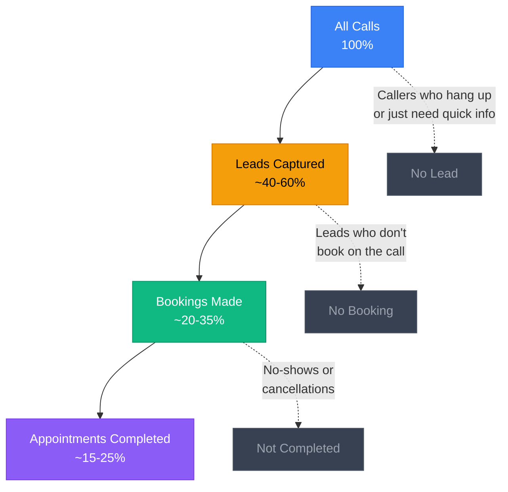

<Note>
**View your analytics:** [Open Analytics Dashboard](https://app.closethecall.com/analytics)
</Note>

Your Analytics page shows you how your AI receptionist is performing and how your business is growing. No spreadsheets, no complicated formulas — just clear numbers that tell you what's working and what needs attention.

## The Conversion Funnel

Every call your AI handles moves through a funnel. Understanding this funnel helps you identify where you're losing potential customers.

## The Six Stat Cards

At the top of your Analytics page, you'll see six cards. Here's what each one means and what a "good" number looks like.

| Stat | What It Measures | What's Good |
|------|-----------------|-------------|
| **Total Calls** | Every call your AI answered in the selected period | Growing month over month. If it's flat, your marketing may need a boost. |
| **New Leads** | Callers who gave their contact details | At least 30-50% of total calls should become leads. |
| **Bookings** | Appointments booked by the AI or manually | Aim for 20-40% of leads converting to bookings. |
| **Avg Call Length** | Average duration of all calls | 2-4 minutes is healthy. Under 1 minute means callers are hanging up too soon. Over 6 minutes may mean the AI is rambling. |
| **Total Minutes** | Sum of all call time used this period | Track this against your plan's included minutes to avoid overages. |
| **Conversion Rate** | Percentage of calls that resulted in a lead or booking | Above 30% is solid. Above 50% is excellent. |

<Tip>
If your conversion rate is below 20%, check your AI's knowledge base. The AI might not have enough information about your services to answer questions confidently, which causes callers to hang up.
</Tip>

## Call Volume Chart

The main chart on the Analytics page shows your call volume over time. Use the date range selector to switch between views:

<CardGroup cols={3}>
  <Card title="7 Days" icon="calendar-week">
    Daily bars for the past week. Good for spotting day-of-week patterns (e.g. Mondays are your busiest day).
  </Card>
  <Card title="30 Days" icon="calendar">
    Daily bars for the past month. Shows weekly trends and whether your call volume is growing.
  </Card>
  <Card title="90 Days" icon="calendar-days">
    Weekly bars for the past quarter. The big picture — are you growing, flat, or declining?
  </Card>
</CardGroup>

## Sentiment Distribution

Below the call volume chart, you'll see a breakdown of how callers felt during their calls:

| Sentiment | What It Means | What to Do |
|-----------|--------------|------------|
| **Positive** | Caller was happy, friendly, or satisfied | Great — your AI is doing its job well. |
| **Neutral** | Standard business call, no strong emotion either way | Normal. Most calls will be neutral. |
| **Negative** | Caller was frustrated, angry, or unhappy | Review these calls. Check if the AI couldn't answer their question or if they were already upset before calling. |

<Info>
Sentiment is detected automatically by the AI based on the caller's tone and language. You don't need to configure anything — it happens on every call.
</Info>

A healthy business typically sees:
- 30-50% positive
- 40-50% neutral
- Under 15% negative

If your negative sentiment is above 20%, listen to some of those call recordings to find out what's going wrong.

## Date Range Selector

Use the date range buttons at the top of the Analytics page to control which time period you're looking at:

- **7 days** — This week's performance
- **30 days** — This month's performance
- **90 days** — This quarter's performance

All six stat cards, the call volume chart, and the sentiment distribution update when you change the date range.

## Exporting Data

You can download your analytics data as a CSV file (opens in Excel, Google Sheets, or any spreadsheet app).

<Steps>
  <Step title="Set your date range">
    Choose 7, 30, or 90 days to control what data is included in the export.
  </Step>
  <Step title="Click Export CSV">
    Click the **Export CSV** button at the top right of the Analytics page.
  </Step>
  <Step title="Open the file">
    The CSV downloads to your computer. Open it in Excel or Google Sheets to sort, filter, or create your own charts.
  </Step>
</Steps>

The CSV includes one row per call with columns for: date, time, caller phone, caller name, duration, service requested, outcome (lead/booking/FAQ), sentiment, and lead temperature.

<Tip>
Export a 90-day CSV and share it with your accountant or business advisor. It gives them a clear picture of your call volume, conversion rates, and busiest days — useful for hiring decisions and marketing budgets.
</Tip>

## What the Numbers Tell You

<Accordion title="Lots of calls but few leads?">
  Your AI might not be asking for contact details. Check that **Capture Lead Info** is enabled in Receptionist Settings. Also review your knowledge base — if the AI can't answer questions about your services, callers may hang up before giving their details.
</Accordion>

<Accordion title="Lots of leads but few bookings?">
  Either your follow-up is too slow (enable the **Estimate Follow-up** automation) or callers aren't ready to book on the call. Consider enabling the **Missed Call Textback** automation to re-engage leads who didn't book.
</Accordion>

<Accordion title="Average call length is under 1 minute?">
  Callers are hanging up quickly. This usually means: (1) the greeting is too long, (2) the AI doesn't sound natural, or (3) the AI can't answer their question. Try a shorter greeting and add more detail to your knowledge base.
</Accordion>

<Accordion title="Average call length is over 6 minutes?">
  The AI might be repeating itself or going off-topic. Review a few long call transcripts and check if the system prompt needs tightening. You can also adjust the AI's personality to be more concise in Receptionist Settings.
</Accordion>

<Accordion title="High negative sentiment?">
  Listen to the recordings of negative calls. Common causes: the AI couldn't answer a specific question (add it to your knowledge base), the caller wanted to speak to a human (enable human transfer), or the caller was already upset before calling (nothing you can do about that).
</Accordion>

---

## Frequently Asked Questions

<Accordion title="What's a good conversion rate for my industry?">
  Conversion rates vary by trade. **Plumbers and HVAC** typically see 35-50% because callers usually have an urgent problem. **Salons and dental practices** see 25-40% since some callers are just enquiring about prices. **Restaurants** see 20-30% as many calls are just for hours or directions. If you're below these ranges, focus on your Knowledge Base — make sure your AI has detailed pricing and service information.
</Accordion>

<Accordion title="How is sentiment calculated?">
  Sentiment is analysed automatically by the AI at the end of each call. It evaluates the caller's tone, word choice, and overall conversation flow. The result is one of three values: **Positive**, **Neutral**, or **Negative**. You do not need to configure anything — it runs on every call automatically. Sentiment data powers the distribution chart on your Analytics page and is included in CSV exports.
</Accordion>

<Accordion title="Can I compare two different time periods?">
  Not directly in the dashboard. However, you can export two CSV files (e.g., one for last month and one for this month) and compare them side by side in a spreadsheet. We recommend using the 30-day view for month-over-month comparisons.
</Accordion>

<Accordion title="Does analytics include test calls?">
  Yes. Every call that reaches your AI number is counted in analytics, including test calls you make yourself. If you're testing frequently, keep this in mind when evaluating your conversion rates — test calls where you don't provide contact details will lower your lead capture percentage. Once you go live with real customers, test calls become a negligible fraction of total volume.
</Accordion>
