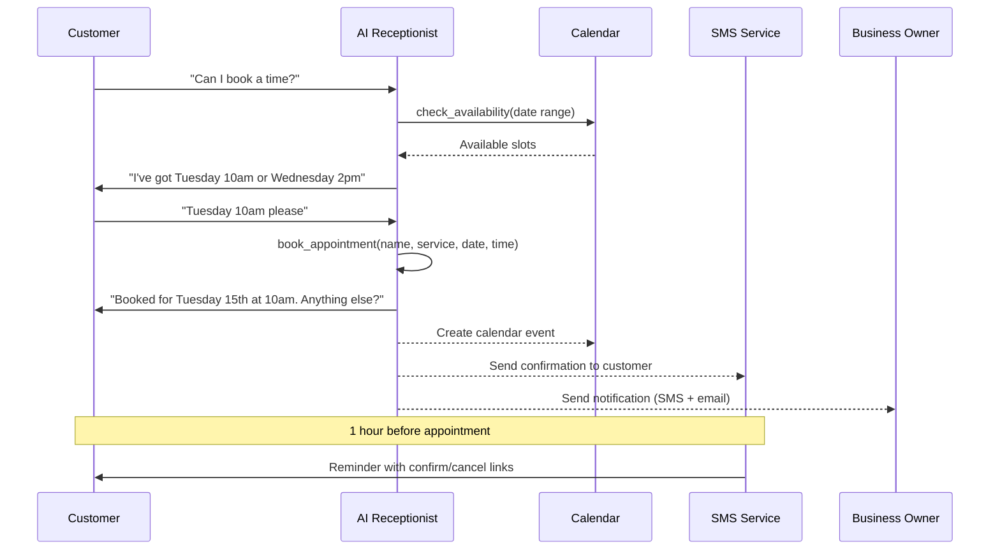

Your AI receptionist can book appointments for you while you're on another job, at lunch, or asleep. It checks your availability, offers times that work, confirms the booking, and sends SMS confirmations — all during a single phone call.

## The booking flow

## During the Call

Here's what happens when a customer wants to book:

<Steps>
  <Step title="Customer asks to book">
    The caller says something like "Can I book a time?" or "When are you free this week?" The AI recognises this as a booking request.
  </Step>
  <Step title="AI checks your availability">
    The AI looks at your calendar (if connected) or your configured business hours to find open time slots. It will never double-book you.
  </Step>
  <Step title="AI offers available times">
    "I've got Tuesday at 10am or Wednesday at 2pm — which works better for you?" The AI always offers choices, not just one slot.
  </Step>
  <Step title="Customer picks a time">
    The caller chooses their preferred slot. The AI confirms the details back to them: "Perfect — I've booked you in for Tuesday the 15th at 10am for a boiler service."
  </Step>
  <Step title="AI reads back all details">
    Before ending the call, the AI reads back the full booking — date, time, service, and any notes — and asks "Is there anything else I can help with?"
  </Step>
</Steps>

<Warning>
The AI will never say "I've booked you in" without actually creating the appointment. If something goes wrong with the booking, it will tell the caller honestly and suggest they call back.
</Warning>

## After the Call

Once the appointment is confirmed, several things happen automatically:

<CardGroup cols={2}>
  <Card title="SMS confirmation" icon="message">
    The customer receives an SMS from your business number confirming the date, time, and service booked.
  </Card>
  <Card title="Calendar sync" icon="calendar">
    If you've connected Google Calendar or Outlook, the appointment appears there immediately.
  </Card>
  <Card title="Owner notification" icon="bell">
    You get an SMS and/or email telling you about the new booking, so you're never caught off guard.
  </Card>
  <Card title="Reminder set" icon="clock">
    An automatic reminder SMS is sent to the customer 1 hour before the appointment. They can confirm or cancel directly from the text.
  </Card>
</CardGroup>

<Tip>
The confirmation SMS is sent from your AI business number — the same one the customer called. So when they reply, it comes back to your Conversations page.
</Tip>

## Connecting Your Calendar

Calendar integration means the AI checks your real schedule before offering times. Without it, the AI uses your configured business hours only.

### Google Calendar

<Steps>
  <Step title="Go to Integrations">
    Navigate to **Integrations** from the sidebar menu.
  </Step>
  <Step title="Click Connect on Google Calendar">
    Find the Google Calendar card and click **Connect**.
  </Step>
  <Step title="Sign in to Google">
    You'll be redirected to Google. Sign in with the account that has your business calendar.
  </Step>
  <Step title="Grant permission">
    Click **Allow** to let CloseTheCall read and create events on your calendar.
  </Step>
  <Step title="Done">
    You'll be redirected back to the dashboard. The card will show **Connected** with a green badge.
  </Step>
</Steps>

### Outlook Calendar

The process is identical — click **Connect** on the Outlook Calendar card, sign in with your Microsoft account, and grant permission.

<Info>
You can connect both Google and Outlook calendars at the same time. The AI will check both for conflicts before offering times.
</Info>

## Creating Manual Appointments

Not every booking comes through a phone call. You can create appointments by hand for walk-ins, website enquiries, or jobs you've arranged in person.

<Steps>
  <Step title="Go to Appointments">
    Click **Appointments** in the sidebar.
  </Step>
  <Step title="Click + New Appointment">
    Click the button at the top right of the page.
  </Step>
  <Step title="Fill in the details">
    Enter the customer name, phone number, service, date, time, and any notes.
  </Step>
  <Step title="Save">
    Click **Create Appointment**. It will appear on your dashboard and sync to your connected calendar.
  </Step>
</Steps>

## Confirming and Declining from Email/SMS

When the appointment reminder goes out 1 hour before, the customer receives a text with two links:

- **Confirm** — Marks the appointment as confirmed. You'll see the status update on your dashboard.
- **Cancel** — Cancels the appointment and frees up the slot. You'll get a notification so you know the slot is open again.

## Appointment Statuses

| Status | What It Means |
|--------|--------------|
| **Upcoming** | Booked and waiting for the date to arrive. |
| **Confirmed** | The customer confirmed via the reminder SMS link. |
| **Rescheduled** | The customer or you moved it to a different time. |
| **Completed** | The job happened. |
| **Cancelled** | Called off by either side. |
| **No Show** | The customer didn't turn up. |

## Frequently asked questions

<Accordion title="Can the AI reschedule an existing appointment?">
Yes. If a customer calls back and says "I need to move my appointment," the AI will cancel the existing booking and create a new one at the time they choose. It will not create duplicates — the old appointment is cancelled before the new one is booked.
</Accordion>

<Accordion title="How does the AI prevent double bookings?">
The AI checks your calendar in real time before offering any time slot. If a slot is already taken (by an AI booking, a manual booking, or a personal calendar event), the AI will not offer it. This check happens during the call, so even if two callers are on the line simultaneously, the second caller will see the first booking reflected.
</Accordion>

<Accordion title="Do I need Google Calendar connected for booking to work?">
No. Booking works without any calendar integration. Without a calendar connected, the AI uses your configured business hours to determine availability. Connecting Google Calendar or Outlook adds real-time schedule awareness so the AI also avoids times when you have personal or other appointments.
</Accordion>

<Accordion title="Can customers cancel via SMS?">
Yes. The reminder SMS sent 1 hour before the appointment includes a cancel link. When the customer clicks it, the appointment is automatically cancelled, the slot is freed up, and you receive a notification. Customers can also call back and ask the AI to cancel for them.
</Accordion>

## Troubleshooting

<Accordion title="The AI offered a time when I'm busy">
  This happens when your calendar isn't connected or the busy event is on a different calendar. Go to **Integrations** and check that the correct calendar is connected. The AI can only see calendars you've given it access to.
</Accordion>

<Accordion title="The customer didn't get a confirmation SMS">
  Check that SMS is enabled for your account (you need a phone number provisioned). Go to **Phone** in the sidebar — if you see your AI number displayed, SMS is working. If not, provision a number first.
</Accordion>

<Accordion title="Appointments aren't showing on my Google Calendar">
  Disconnect and reconnect Google Calendar from the **Integrations** page. Google OAuth tokens expire after a while, and reconnecting refreshes them.
</Accordion>

---

<Card title="View your appointments" icon="arrow-up-right-from-square" href="https://app.closethecall.com/bookings">
  Open the Appointments page to see upcoming bookings, create new ones, or manage existing ones.
</Card>
