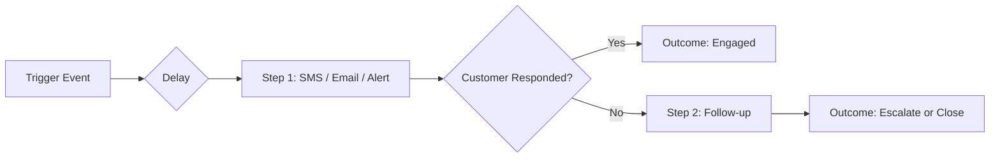

Automations handle the follow-up work that most small businesses forget to do. They send texts, emails, and owner alerts on your behalf — automatically — so you can focus on doing the actual work.

You'll find all automations on the [Automations page](https://app.closethecall.com/automations) in your sidebar.

## How a Pipeline Works

Every automation follows the same pattern: a trigger fires, one or more steps execute across channels, and you get a measurable outcome.

## The 10 Pipelines

| # | Pipeline | Trigger | Steps | Channels | Description |
|---|----------|---------|-------|----------|-------------|
| 1 | **Missed Call Rescue** | Missed call / hangup / voicemail | SMS within 60s, email if no reply in 30min | SMS, Email, Owner Alert | Recovers leads from calls the AI couldn't handle. Businesses that text back within 1 minute recover up to 40% of missed leads. |
| 2 | **Lead Nurture** | New lead captured | Immediate owner alert, then 24h follow-up SMS if no contact made | SMS, Email, Owner Alert | Makes sure no lead slips through the cracks. Notifies you instantly and follows up if you haven't reached out. |
| 3 | **Appointment Lifecycle** | Appointment booked | 1h reminder with confirm/cancel links, post-appointment review request | SMS | Reduces no-shows with a timely reminder, then captures a review from happy customers. |
| 4 | **Quote Follow-up** | Quote sent but not accepted | AI-personalised follow-up SMS after configurable delay (default 24h) | SMS, Email | Uses the original call transcript to write a personalised nudge rather than a generic "just following up." |
| 5 | **Morning Briefing** | Daily at 08:00 local time | Email summary of yesterday's calls, leads, appointments, and action items | Email | Start every day knowing exactly what happened and what needs attention. |
| 6 | **No-Show Recovery** | Appointment marked as no-show | SMS to customer offering to rebook, owner alert | SMS, Owner Alert | Recovers revenue from missed appointments by offering an easy rebook link. |
| 7 | **Payment Chase** | Invoice overdue | Reminder at 1 day, 3 days, and 7 days overdue | SMS, Email | Politely chases unpaid invoices on an escalating schedule so you don't have to send awkward texts. |
| 8 | **Win Back** | Lead inactive for 30+ days | Re-engagement SMS with seasonal or promotional offer | SMS | Brings cold leads back into your pipeline with a timely nudge. |
| 9 | **Negative Sentiment** | Call flagged as negative sentiment | Owner alert within 5 minutes, no review request sent | Owner Alert | Flags unhappy callers immediately so you can personally intervene before they leave a bad review. |
| 10 | **Onboarding Drip** | New account created | Welcome email, setup tips at day 1/3/7, "Need help?" check-in | Email | Guides new users through setup so they get value from CloseTheCall quickly. |

## Multi-Channel Delivery

Each pipeline can use one or more channels depending on what makes sense for the situation.

<CardGroup cols={3}>
  <Card title="SMS" icon="comment-sms">
    Text messages to the customer's phone. Best for urgent, time-sensitive actions like missed call recovery and appointment reminders.
  </Card>
  <Card title="Email" icon="envelope">
    Branded HTML emails for longer content like morning briefings, invoice reminders, and onboarding tips.
  </Card>
  <Card title="Owner Alert" icon="bell">
    Notifications to you (and your team) by SMS and/or email. Used when something needs human attention — a hot lead, a negative call, or a no-show.
  </Card>
</CardGroup>

## Pipeline Details

### 1. Missed Call Rescue

When someone calls and the AI can't connect (e.g. the AI is already on another call, or the caller hangs up too quickly), this pipeline kicks in.

**Default message:**
> "Hi, thanks for calling [Your Business]. Sorry we missed you! Reply to this text and we'll get back to you ASAP."

**Configuration:**
- Toggle on/off
- Customise the SMS template (variables: `{businessName}`, `{callerName}`)
- Set delay before sending (default: 60 seconds)

<Tip>
This is the single highest-impact automation. Enable it first.
</Tip>

### 2. Lead Nurture

Fires the moment a new lead is captured by the AI during a call or chat.

- Sends you an SMS and/or email notification immediately
- If you haven't contacted the lead within 24 hours, sends a follow-up SMS to the customer

### 3. Appointment Lifecycle

Two stages in one pipeline:

1. **Reminder** — 1 hour before the appointment, the customer gets an SMS with **Confirm** and **Cancel** links. If they cancel, the slot is freed and you're notified.
2. **Review Request** — After a completed appointment, sends a Google review request SMS. Skips customers whose call had negative sentiment.

### 4. Quote Follow-up

When a quote is sent but the customer hasn't responded:

- The AI reads the original call transcript and writes a personalised follow-up
- Falls back to your template if personalisation fails
- Configurable delay (default: 24 hours)

### 5. Morning Briefing

A daily email digest at 08:00 local time containing:

- Yesterday's call count and average duration
- New leads captured (with temperature badges)
- Upcoming appointments for today
- Action items (unanswered leads, pending quotes, overdue invoices)

### 6. No-Show Recovery

When an appointment is marked as a no-show:

- Customer gets an SMS: "We missed you today! Would you like to rebook? Reply YES and we'll find a new time."
- You get an owner alert so you can follow up personally if needed

### 7. Payment Chase

Escalating reminders for overdue invoices:

- **Day 1:** Friendly SMS reminder with payment link
- **Day 3:** Email with invoice details and payment link
- **Day 7:** Final reminder SMS + owner alert to follow up manually

### 8. Win Back

For leads that went cold (no activity in 30+ days):

- Sends a re-engagement SMS
- Can include seasonal promotions or limited-time offers
- Configurable inactivity threshold

### 9. Negative Sentiment

When the AI detects negative sentiment on a call:

- Owner gets an alert within 5 minutes
- The review request automation is automatically suppressed for this customer
- Gives you a chance to personally call back and resolve the issue

### 10. Onboarding Drip

For new CloseTheCall users:

- **Day 0:** Welcome email with quick-start steps
- **Day 1:** "Set up your knowledge base" tip
- **Day 3:** "Enable your first automation" tip
- **Day 7:** "Need help?" check-in with link to support

---

## Safety Features

Every pipeline includes built-in safeguards to prevent spam, comply with regulations, and avoid annoying your customers.

| Safety Feature | What It Does |
|----------------|-------------|
| **SMS Opt-Out (STOP)** | If a customer replies STOP to any text, all automated SMS to that number halt immediately. They can text START to re-subscribe. This is a legal requirement (TCPA/PECR). |
| **Rate Limiting** | No customer receives more than 3 automated messages per day across all pipelines. Prevents message fatigue. |
| **Loop Prevention** | If an automation triggers another automation (e.g. a follow-up SMS triggers a new conversation), the loop is detected and broken after one cycle. |
| **Retry with Backoff** | If an SMS or email fails to send, the system retries up to 3 times with exponential backoff (1min, 5min, 15min). |
| **Deduplication** | The same message is never sent twice to the same customer for the same event, even if the webhook fires multiple times. |
| **Sentiment Gating** | Review requests are automatically suppressed for calls with negative sentiment. |
| **Business Hours Awareness** | Owner alerts respect your notification preferences. Morning briefings send at your local 08:00, not UTC. |

<Warning>
If a customer replies **STOP** to any automated text, they are automatically unsubscribed from ALL future SMS automations. This is a legal requirement and cannot be overridden. The customer can text **START** to re-subscribe.
</Warning>

## Visual Workflow Builder

For advanced users who want to create custom automation pipelines or modify the built-in ones, CloseTheCall includes a visual workflow builder. You can drag and drop triggers, conditions, delays, and actions to build any workflow you can imagine.

See the [Workflow Builder guide](/automations/workflow-builder) for details.

## Enabling and Disabling

Each pipeline has its own on/off toggle. Turning one off doesn't affect the others. When disabled:

- No new messages will be sent for that pipeline
- Messages already queued will still be delivered
- Your configuration is saved so you can re-enable without starting over

<Accordion title="Can I see which messages were sent?">
  Yes. Every automated SMS appears in your **Conversations** page with a tag showing which automation triggered it. Emails appear in your account's email log.
</Accordion>

<Accordion title="Do automations cost extra?">
  No. All 10 pipelines are included in every plan. The only cost is the SMS messages themselves, which come out of your plan's SMS allowance.
</Accordion>

<Accordion title="Can I customise the delay for each pipeline?">
  Yes. Every pipeline with a delay step lets you configure the timing. Some pipelines (like Payment Chase) have multiple delay steps that can each be adjusted independently.
</Accordion>
