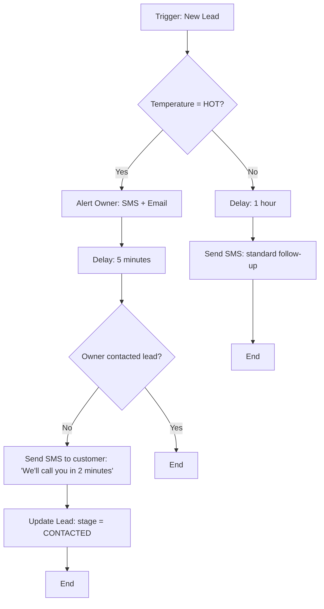

The Workflow Builder lets you create custom automation pipelines beyond the 10 built-in ones. Drag and drop nodes onto a canvas, connect them, and your workflow runs automatically whenever the trigger fires.

Open it from the [Automations page](https://app.closethecall.com/automations) by clicking **+ New Workflow**.

## The Builder Layout

The builder has three panels:

```
+----------------+----------------------------------+------------------+
|                |                                  |                  |
|   NODE         |          CANVAS                  |   CONFIG         |
|   PALETTE      |                                  |   PANEL          |
|                |   +--------+                     |                  |
|   [Trigger]    |   | Missed |----+                |  Node: Send SMS  |
|   [Condition]  |   | Call   |    |                |                  |
|   [Delay]      |   +--------+    v                |  To: {caller}    |
|   [Send SMS]   |            +----------+          |  Message:        |
|   [Send Email] |            | Wait 60s |          |  "Hi {name},    |
|   [Alert Owner]|            +----------+          |   thanks for..." |
|   [Update Lead]|                 |                |                  |
|   [Create Task]|                 v                |  Variables:      |
|   [Webhook]    |          +-----------+           |  {name}          |
|   [Branch]     |          | Send SMS  |           |  {businessName}  |
|                |          +-----------+           |  {service}       |
|                |                 |                |  {phone}         |
|                |                 v                |                  |
|                |          +-----------+           |                  |
|                |          | Alert     |           |                  |
|                |          | Owner     |           |                  |
|                |          +-----------+           |                  |
|                |                                  |                  |
+----------------+----------------------------------+------------------+
```

- **Node Palette** (left) -- Drag nodes from here onto the canvas
- **Canvas** (centre) -- Connect nodes by dragging lines between them
- **Config Panel** (right) -- Click any node to configure its settings

## Node Types

There are 10 node types you can use to build any workflow.

| Node | Icon | What It Does | Configuration |
|------|------|-------------|---------------|
| **Trigger** | Lightning bolt | Starts the workflow when an event occurs | Select event type (see trigger list below) |
| **Condition** | Diamond | Branches the flow based on a rule | Field, operator, value (e.g. temperature = HOT) |
| **Delay** | Clock | Waits before continuing | Duration (minutes, hours, or days) |
| **Send SMS** | Message bubble | Sends a text message to the customer | Recipient, message template with variables |
| **Send Email** | Envelope | Sends a branded email | Recipient, subject, body template |
| **Alert Owner** | Bell | Notifies you (and team) by SMS and/or email | Channel selection, message template |
| **Update Lead** | Pencil | Changes a field on the lead record | Field to update, new value |
| **Create Task** | Clipboard | Creates a follow-up task in your dashboard | Title, due date, assignee |
| **Webhook** | Globe | Sends data to an external URL (Zapier, Make, etc.) | URL, HTTP method, payload template |
| **Branch** | Fork | Splits the flow into two or more paths | Number of branches, labels |

### Available Triggers

| Trigger | Fires When |
|---------|-----------|
| New Call | Any call is received (answered, missed, or voicemail) |
| Missed Call | A call is missed or goes to voicemail |
| New Lead | A lead is captured by the AI |
| Lead Stage Changed | A lead is moved to a different column on the board |
| Appointment Booked | A new appointment is created |
| Appointment Cancelled | A customer cancels an appointment |
| Appointment No-Show | An appointment is marked as no-show |
| Quote Sent | A quote is sent to a customer |
| Quote Accepted | A customer accepts a quote |
| Quote Rejected | A customer declines a quote |
| Invoice Overdue | An invoice passes its due date |
| Negative Sentiment | A call is flagged with negative sentiment |
| Customer Opted Out | A customer texts STOP |
| Custom Webhook | An external system sends data to your webhook URL |

## Building a Custom Workflow -- Example

Here's how you might build a "VIP Lead Fast Track" workflow that gives special treatment to high-value leads.



To build this:

<Steps>
  <Step title="Add a Trigger node">
    Drag a **Trigger** node onto the canvas. Set the event to **New Lead**.
  </Step>
  <Step title="Add a Condition node">
    Drag a **Condition** node and connect it to the trigger. Set the rule: `temperature` equals `HOT`.
  </Step>
  <Step title="Build the HOT path">
    From the "Yes" branch, add **Alert Owner**, then **Delay** (5 minutes), then another **Condition** (owner contacted?), then **Send SMS** and **Update Lead**.
  </Step>
  <Step title="Build the non-HOT path">
    From the "No" branch, add **Delay** (1 hour), then **Send SMS** with a standard follow-up message.
  </Step>
  <Step title="Save and enable">
    Click **Save Workflow** in the top right. Toggle it **ON** to activate.
  </Step>
</Steps>

## Template Variables

Use these variables in any SMS, email, or alert message. They are replaced with real values when the workflow runs.

| Variable | Value |
|----------|-------|
| `{name}` | Customer's name (if known) |
| `{firstName}` | Customer's first name |
| `{phone}` | Customer's phone number |
| `{email}` | Customer's email address |
| `{service}` | Service they asked about |
| `{businessName}` | Your business name |
| `{businessPhone}` | Your AI phone number |
| `{quoteTotal}` | Quote total (if applicable) |
| `{appointmentDate}` | Appointment date (if applicable) |
| `{appointmentTime}` | Appointment time (if applicable) |
| `{temperature}` | Lead temperature (HOT/WARM/COOL/COLD) |
| `{stage}` | Lead stage (NEW/CONTACTED/QUOTED/etc.) |
| `{callerName}` | Name from caller intelligence lookup |
| `{callDuration}` | Duration of the last call |
| `{sentiment}` | Call sentiment (positive/neutral/negative) |

## Saving and Enabling

- **Save Draft** -- Saves the workflow without activating it. Good for testing.
- **Enable** -- Turns the workflow on. It will fire on the next matching trigger event.
- **Disable** -- Pauses the workflow. Queued actions will still complete, but no new runs will start.
- **Delete** -- Permanently removes the workflow.

<Info>
Each workflow has a run history showing every time it fired, which path was taken, and the outcome. Open a workflow and click the **History** tab to review.
</Info>

## Safety and Limits

All workflows inherit the same safety features as built-in automations:

- **SMS opt-out compliance** -- Workflows cannot send SMS to customers who have opted out (STOP)
- **Rate limiting** -- Maximum 3 automated messages per customer per day across all workflows
- **Loop detection** -- If a workflow triggers itself (or another workflow that triggers it back), the loop is broken after one cycle
- **Retry** -- Failed SMS/email actions retry up to 3 times with exponential backoff

<Warning>
Workflows run in addition to built-in automations. If you have both the built-in Missed Call Textback enabled AND a custom workflow that sends an SMS on missed calls, the customer will receive two texts. Disable the built-in one if your custom workflow replaces it.
</Warning>

<Accordion title="How many workflows can I create?">
  There is no limit on the number of workflows. However, the rate limiting rules apply across all workflows combined -- a customer will never receive more than 3 automated messages per day.
</Accordion>

<Accordion title="Can I duplicate an existing workflow?">
  Yes. Open any workflow and click **Duplicate** to create a copy that you can modify.
</Accordion>

<Accordion title="Can I test a workflow without it firing for real?">
  Save it as a draft. Then click **Test Run** to simulate a trigger event and see which path the workflow takes, without actually sending any messages.
</Accordion>
