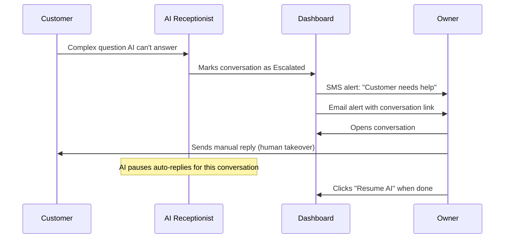

The Conversations page is your unified inbox for every text-based conversation with your customers. SMS, WhatsApp, Web Chat, and Email threads all appear here -- so you never have to check multiple apps.

Open it at [app.closethecall.com/conversations](https://app.closethecall.com/conversations).

## Five Channels, One Inbox

<CardGroup cols={3}>
  <Card title="SMS" icon="comment-sms">
    Customers who text your AI number get automatic replies. The AI handles FAQs, booking requests, and lead capture -- just like a phone call, but over text.
  </Card>
  <Card title="WhatsApp" icon="whatsapp">
    If your business has WhatsApp Business connected, incoming messages are handled by the same AI and appear in the same inbox.
  </Card>
  <Card title="Web Chat" icon="browser">
    The chat widget on your website creates conversations here too. Visitors can ask questions, book appointments, and become leads without picking up the phone.
  </Card>
</CardGroup>

<CardGroup cols={2}>
  <Card title="Email" icon="envelope">
    Inbound emails to your AI address are answered by the same AI brain. Replies land in the customer's normal inbox. See the [AI Email Replies](/ai-receptionist/ai-email-replies) dedicated guide.
  </Card>
  <Card title="Voice (read-only)" icon="phone">
    Phone call transcripts appear as conversation threads so you can see the full history with each customer across every channel.
  </Card>
</CardGroup>

## The Conversations List

The left panel shows all conversations, similar to a messaging app. Each entry shows:

- **Customer name** (if known) or phone number
- **Last message** preview
- **Timestamp** of the most recent message
- **Channel badge** (SMS, WhatsApp, Web Chat, Email)
- **Status** -- Active, Escalated, or Closed

Click any conversation to open the full message history on the right.

### Channel Filters

Use the filter buttons at the top to show only certain channels: **All**, **SMS**, **WhatsApp**, **Web Chat**, or **Email**.

<Tip>
Use the search bar to find a specific customer by name, phone number, or message content.
</Tip>

## Quick Actions

Four actions are available at the top of every conversation:

<CardGroup cols={2}>
  <Card title="Call" icon="phone">
    Call the customer back through your AI number with one click.
  </Card>
  <Card title="Email" icon="envelope">
    Send a follow-up email from your business address.
  </Card>
  <Card title="Text" icon="message">
    Send an SMS from your AI number (even if the original conversation was on a different channel).
  </Card>
  <Card title="Escalate" icon="triangle-exclamation">
    Flag the conversation for human attention. Triggers an owner alert via SMS and email.
  </Card>
</CardGroup>

## Escalation Flow

When you or the AI escalates a conversation, the owner and team members are notified immediately.

Escalated conversations appear with a red badge in the list so you can spot them immediately.

**What triggers escalation:**
- You click the **Escalate** button manually
- The AI detects it can't answer a question (auto-escalation)
- The customer asks to speak to a real person
- Negative sentiment is detected in the conversation

## SMS Auto-Reply Toggle

SMS auto-reply is the core feature powering text conversations. When enabled:

<Steps>
  <Step title="Customer texts your AI number">
    They text something like "Hi, do you do emergency plumbing?"
  </Step>
  <Step title="AI reads and replies">
    The AI uses your knowledge base to generate a helpful reply and sends it from your business number.
  </Step>
  <Step title="Conversation continues">
    The customer can reply, and the AI responds again. It's a natural back-and-forth -- the customer usually can't tell it's AI.
  </Step>
  <Step title="Lead is captured">
    If the customer provides their name or asks about a service, a lead is created automatically.
  </Step>
</Steps>

<Info>
You'll see an **SMS Replies** toggle at the top of the Conversations page. Make sure it's turned on for auto-replies to work.
</Info>

## Human Takeover

Sometimes you need to step in and reply as yourself.

<Steps>
  <Step title="Open the conversation">
    Click the conversation you want to take over.
  </Step>
  <Step title="Type your reply">
    Use the message input at the bottom. Type your message as you normally would.
  </Step>
  <Step title="Send">
    Click **Send** or press Enter. The AI pauses automatic replies for this conversation.
  </Step>
</Steps>

When you send a manual reply:
- The AI stops auto-replying to this specific conversation
- The conversation is marked as "human-managed"
- You can hand it back to the AI by clicking the **Resume AI** button

<Warning>
The customer sees messages from the same number -- they won't know the difference between AI and human replies. Keep your tone consistent.
</Warning>

## AI Email Replies

Your AI can also handle inbound emails using the same knowledge base it uses for calls and texts. Customers email your AI address, the AI reads the message, and sends a helpful reply -- the customer sees it in their normal inbox.

For full setup instructions, anti-spam safeguards, and configuration details, see the dedicated [AI Email Replies](/ai-receptionist/ai-email-replies) guide.

## Right Panel -- Customer Info

When you open a conversation, the right panel shows:

- **Name** and **phone number**
- **Email** (if provided)
- **Lead status** (New, Contacted, Quoted, Booked, Won, Lost)
- **Lead temperature** (HOT, WARM, COOL, COLD)
- **Previous calls** -- links to call recordings
- **Appointments** -- upcoming or past bookings
- **Notes** -- add your own notes to the customer record

<Tip>
The customer info panel pulls from your Lead Board. Updates sync both ways.
</Tip>

## SMS Opt-Out (STOP Keyword)

<Warning>
When a customer texts **STOP**, all automated SMS messages to that number halt immediately. This is a legal requirement (TCPA in the US, PECR in the UK). The customer must text **START** to opt back in.
</Warning>

What happens when someone texts STOP:
- All automations stop sending to that number
- The conversation is marked with an "Opted Out" badge
- Manual SMS shows a warning that the customer has opted out
- The AI will not send automatic replies to that number

## WhatsApp Support

WhatsApp works the same way as SMS -- the AI reads incoming messages and replies using your knowledge base. To enable:

1. Connect a WhatsApp Business account to your phone number
2. Configure the incoming webhook (your account manager can help)
3. WhatsApp messages appear alongside SMS and Web Chat in the Conversations page

## Web Chat Widget

The Web Chat widget is installed on your website. Conversations from it appear here in your inbox. To set up the widget, go to **Chat Widget** in the sidebar. See the [Chat Widget setup guide](/chat-widget/setup) for instructions.

<Accordion title="Can I see which messages were sent by the AI vs. by me?">
  Yes. AI messages show a small "AI" badge. Your manual messages show your name.
</Accordion>

<Accordion title="Is there a limit to conversations?">
  No. Unlimited conversations. The only limit is your plan's SMS allowance for outgoing texts.
</Accordion>

<Accordion title="What if someone texts outside business hours?">
  The AI replies 24/7. If you have after-hours settings configured, the AI mentions your hours and offers to book an appointment for the next available time.
</Accordion>
