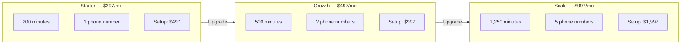

## Try Free for 7 Days

<Note>
**No credit card required.** CTC and RCA brands offer a 7-day free trial with up to 50 minutes of AI call time. Sign up, get your AI number, and start answering calls today. Upgrade to a paid plan when you are ready.
</Note>

## Which plan is right for you?

CloseTheCall offers three simple plans. Every plan includes your own AI receptionist, a dedicated phone number, SMS confirmations, lead capture, and appointment booking. The only difference is how many minutes of AI call time you get each month.

<CardGroup cols={3}>
  <Card title="Starter" icon="seedling">
    **$297/month**
    - 200 AI minutes included
    - 1 phone number
    - SMS confirmations
    - Lead capture
    - Appointment booking
    - Knowledge base
    - Email support
    - Setup fee: $497
  </Card>
  <Card title="Growth" icon="chart-line">
    **$497/month**
    - 500 AI minutes included
    - 2 phone numbers
    - Everything in Starter
    - Priority support
    - Google Calendar sync
    - CRM integrations
    - AI call learning
    - Setup fee: $997
  </Card>
  <Card title="Scale" icon="rocket">
    **$997/month**
    - 1,250 AI minutes included
    - 5 phone numbers
    - Everything in Growth
    - Multi-location support
    - Team management
    - Advanced analytics
    - Dedicated account manager
    - Setup fee: $1,997
  </Card>
</CardGroup>

## What counts as a "minute"?

A minute is one minute of AI call time — the time your AI receptionist spends talking to a caller. Here is what you need to know:

- A typical call lasts **1 to 3 minutes** (greeting, booking, or answering a question)
- On the Starter plan with 200 minutes, that is roughly **70 to 200 calls per month**
- Minutes only count when the AI is actively on a call — hold time and ringing do not count
- Unused minutes do **not** roll over to the next month

<Tip>
Most small businesses use between 100 and 300 minutes per month. If you are unsure, start with Starter and upgrade later — it takes 30 seconds.
</Tip>

## What happens if I run out of minutes?

If you use all your included minutes, your AI receptionist keeps working. You are simply charged for extra minutes at these rates:

| Plan | Overage Rate |
|------|-------------|
| Starter | $0.85 per minute |
| Growth | $0.65 per minute |
| Scale | $0.45 per minute |

<Info>
You will receive an email alert when you hit 80% of your included minutes so there are no surprises on your bill.
</Info>

## How to subscribe to a plan

<Steps>
  <Step title="Go to Billing">
    Click **Billing** in the left sidebar of your [dashboard](https://app.closethecall.com/billing).
  </Step>
  <Step title="Choose your plan">
    You will see three plan cards. Click the **Subscribe** button on the plan you want.
  </Step>
  <Step title="Complete payment">
    You will be taken to a secure Stripe checkout page. Enter your card details and confirm. You will be redirected back to your dashboard automatically.
  </Step>
</Steps>

## How to upgrade or downgrade

<Steps>
  <Step title="Go to Billing">
    Click **Billing** in the left sidebar.
  </Step>
  <Step title="Click Manage Subscription">
    Click the **Manage Subscription** button at the top of the page. This opens the Stripe billing portal.
  </Step>
  <Step title="Change your plan">
    In the Stripe portal, click **Update plan** and select your new tier. Changes take effect immediately — you will be charged or credited the prorated difference.
  </Step>
</Steps>

<Tip>
Upgrading is instant. Your new minute allowance is available right away, and you only pay for the remaining days in your billing cycle.
</Tip>

## How to update your payment method

<Steps>
  <Step title="Open the Stripe portal">
    Go to **Billing** and click **Manage Subscription**.
  </Step>
  <Step title="Update payment method">
    Click **Update payment method** in the portal. Add your new card and set it as default.
  </Step>
</Steps>

## How to cancel

<Steps>
  <Step title="Open the Stripe portal">
    Go to **Billing** and click **Manage Subscription**.
  </Step>
  <Step title="Cancel subscription">
    Click **Cancel plan**. Your AI receptionist will continue working until the end of your current billing period.
  </Step>
</Steps>

<Warning>
After cancellation, your AI phone number will be released and your receptionist will stop answering calls. Your data (leads, call history, knowledge base) is kept for 30 days in case you resubscribe.
</Warning>

## Viewing your usage

On the [Billing](https://app.closethecall.com/billing) page, you can see:

- **Minutes used** this billing period (with a progress bar)
- **Calls handled** this month
- **Leads captured** this month
- **Next billing date** and amount

## Invoices and receipts

All invoices are available in the Stripe billing portal. Click **Manage Subscription** then **Billing history** to download PDF receipts for your records.

## Frequently Asked Questions

<AccordionGroup>
  <Accordion title="Is there a free trial?">
    Yes. CTC and RCA brands offer a **7-day free trial** with no credit card required. You get up to 50 minutes of AI call time during the trial. Your AI receptionist is fully functional — same features as a paid plan, just with a minute cap.
  </Accordion>
  <Accordion title="Can I switch plans mid-month?">
    Yes. Upgrades take effect immediately and you are charged the prorated difference for the remaining days. Downgrades also take effect immediately — you receive a prorated credit on your next invoice.
  </Accordion>
  <Accordion title="What happens when I hit my minute limit?">
    Your AI receptionist keeps answering calls. You are charged overage at your plan's rate ($0.85/min Starter, $0.65/min Growth, $0.45/min Scale). You get an email warning at 80% usage and again when you hit 100% so you can upgrade if the overage rate is too high.
  </Accordion>
  <Accordion title="Are there setup fees?">
    Yes. Each plan has a one-time setup fee: **$497** (Starter), **$997** (Growth), or **$1,997** (Scale). This covers AI assistant creation, phone number provisioning, website scraping, knowledge base setup, and initial configuration.
  </Accordion>
</AccordionGroup>
