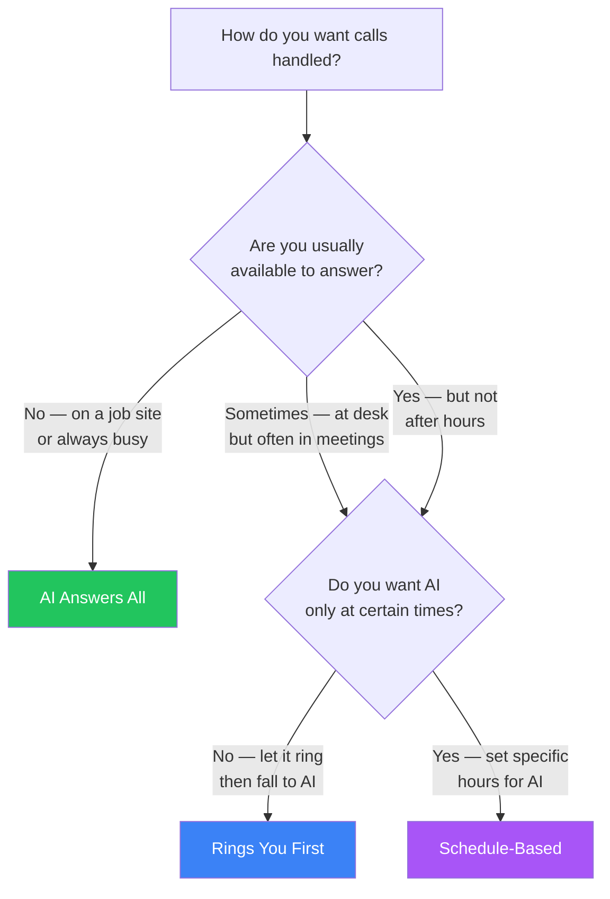

## The Concept

```
BEFORE CloseTheCall:
  Customer calls → Your phone rings → You answer (or miss it)

AFTER CloseTheCall:
  Customer calls → Forwards to AI → AI answers 24/7
  → Captures lead → Notifies you → You call back when free
```

## Three Options

<CardGroup cols={3}>
  <Card title="AI Answers All" icon="robot">
    All calls go to AI. Best for trades on-site.
    Code: `**21*{AI number}#`
  </Card>
  <Card title="Rings You First" icon="phone-volume">
    Phone rings 20s, then AI. Best for desk workers.
    Code: `**61*{AI number}#`
  </Card>
  <Card title="Schedule-Based" icon="calendar-clock">
    During hours → you. After hours → AI.
    Set schedule in Phone page.
  </Card>
</CardGroup>

## Quick Decision Guide



| Your Situation | Choose |
|---------------|--------|
| Always on a job site | AI Answers All |
| At desk but sometimes busy | Rings You First |
| Want AI only after 5pm | Schedule-Based |
| One-person business | AI Answers All |
| Have a receptionist during day | Schedule-Based |

## How to Set Up

<Steps>
  <Step title="Go to Call Forwarding page">
    Find it in the sidebar under Configuration
  </Step>
  <Step title="Select your country">
    UK, US, or Australia
  </Step>
  <Step title="Find your carrier">
    Click your carrier from the grid below to see step-by-step instructions
  </Step>
  <Step title="Follow the dial codes">
    Each carrier shows exact codes to type into your phone dialler
  </Step>
  <Step title="Test it">
    Call your business number — AI should answer
  </Step>
</Steps>

## Supported Carriers (25 total)

### UK (9 carriers)
| Carrier | Type | Unanswered Forward | All Calls Forward |
|---------|------|-------------------|-------------------|
| **EE** | Mobile | `**61*{AI number}#` | `**21*{AI number}#` |
| **O2** | Mobile | `**61*{AI number}#` | `**21*{AI number}#` |
| **Vodafone** | Mobile | `**61*{AI number}#` | `**21*{AI number}#` |
| **Three** | Mobile | `**61*{AI number}#` | `**21*{AI number}#` |
| **BT Mobile** | Mobile | `**61*{AI number}#` | `**21*{AI number}#` |
| **Sky** | Mobile | `**61*{AI number}#` | `**21*{AI number}#` |
| **Virgin** | Mobile | `**61*{AI number}#` | `**21*{AI number}#` |
| **BT Landline** | Landline | Contact BT or use 1571 settings | Contact BT |
| **TalkTalk** | Landline | Contact TalkTalk or use online portal | Contact TalkTalk |

### US (7 carriers)
| Carrier | Type | Unanswered Forward | All Calls Forward |
|---------|------|-------------------|-------------------|
| **AT&T** | Mobile | `**61*{AI number}#` | `**21*{AI number}#` |
| **T-Mobile** | Mobile | `**61*{AI number}#` | `**21*{AI number}#` |
| **Verizon** | Mobile | `*71{AI number}` | `*72{AI number}` |
| **Cricket** | Mobile | `**61*{AI number}#` | `**21*{AI number}#` |
| **Mint** | Mobile | `**61*{AI number}#` | `**21*{AI number}#` |
| **US Cellular** | Mobile | `**61*{AI number}#` | `**21*{AI number}#` |
| **Landline** | Landline | Contact your provider | `*72{AI number}` |

### AU (6 carriers)
| Carrier | Type | Unanswered Forward | All Calls Forward |
|---------|------|-------------------|-------------------|
| **Telstra** | Mobile | `**61*{AI number}#` | `**21*{AI number}#` |
| **Optus** | Mobile | `**61*{AI number}#` | `**21*{AI number}#` |
| **Vodafone AU** | Mobile | `**61*{AI number}#` | `**21*{AI number}#` |
| **TPG/iiNet** | Mobile | `**61*{AI number}#` | `**21*{AI number}#` |
| **Boost** | Mobile | `**61*{AI number}#` | `**21*{AI number}#` |
| **AU Landline** | Landline | Contact your provider | `*21{AI number}#` |

<Info>
Dial codes shown are the most common. Your dashboard shows carrier-specific codes with step-by-step instructions when you click on your carrier.
</Info>

## Cancelling Forwarding

| Type | Dial Code |
|------|-----------|
| Cancel all-calls forwarding | `##21#` |
| Cancel unanswered forwarding | `##61#` |
| Cancel ALL forwarding types | `##002#` |

<Info>
Your AI number stays active even when forwarding is off. Direct calls to the AI number still work.
</Info>

## Frequently Asked Questions

<AccordionGroup>
  <Accordion title="Can I change routing mid-month?">
    Yes, absolutely. You can switch between AI Answers All, Rings You First, and Schedule-Based at any time from the Phone page in your dashboard. Changes take effect on the next incoming call. There is no limit on how often you can change.
  </Accordion>
  <Accordion title="What if my carrier isn't listed?">
    Most carriers support standard GSM forwarding codes (`**21*` for all calls, `**61*` for unanswered). Try the standard codes first. If they do not work, contact your carrier and ask them to enable "call forwarding to an external number." You can also contact our support team for help.
  </Accordion>
  <Accordion title="Does forwarding use my phone minutes?">
    Call forwarding may use your mobile plan minutes depending on your carrier. The forwarded leg (from your phone to the AI number) counts as an outgoing call on your mobile plan. The AI answering time counts against your CloseTheCall plan minutes. Check with your carrier for specifics.
  </Accordion>
  <Accordion title="Can I forward to multiple AI numbers?">
    Each business gets one AI phone number. All forwarded calls go to that single number. If you have multiple locations, each location can have its own AI number — set these up on the Locations page in your dashboard.
  </Accordion>
</AccordionGroup>
