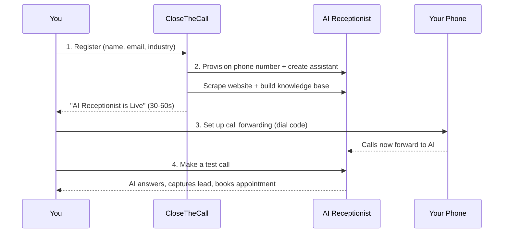

## What You'll Achieve

By the end of this guide, your AI receptionist will be answering calls for your business. The whole process takes under 10 minutes.

<Note>
**Free trial available.** CTC and RCA brands offer a 7-day free trial with no credit card required (50-minute cap). Start answering calls today and upgrade when you are ready.
</Note>

<Steps>
  <Step title="Create Your Account (2 minutes)">
    1. Go to [app.closethecall.com/register](https://app.closethecall.com/register)
    2. Enter your **name, email, and password**
    3. Enter your **business name** and select your **industry**
    4. *(Optional)* Enter your **website URL** — the AI will automatically learn your services, pricing, and hours
    5. Click **Create Account**
  </Step>

  <Step title="Your AI Number Gets Provisioned (automatic)">
    The system automatically:
    - Gets you a dedicated **phone number**
    - Creates your **AI assistant**
    - Scrapes your **website** for business info
    - Builds your AI's **knowledge base**

    You'll see **"AI Receptionist is Live"** with your new phone number in the top-right corner.

    <Info>This usually takes 30-60 seconds. If it takes longer, refresh the page.</Info>
  </Step>

  <Step title="Forward Your Phone (3 minutes)">
    Go to the **Call Forwarding** page in the sidebar.
    1. Select your **country** (UK, US, or AU)
    2. Find your **carrier** (EE, Vodafone, T-Mobile, etc.)
    3. Follow the **step-by-step dial codes** shown
    4. **Test it:** call your business number — the AI should answer!
  </Step>

  <Step title="Make a Test Call (2 minutes)">
    Call your AI number from your mobile and try these:

    - *"I need a plumber for a leak"*
    - *"How much do you charge?"*
    - *"Can I book an appointment for next Tuesday?"*

    Then check your dashboard:
    - Call appears in **Recent Calls**
    - Lead appears in **Customers**
    - Booking appears in **Appointments** (if you booked one)
  </Step>
</Steps>

## Troubleshooting

<AccordionGroup>
  <Accordion title="No phone number provisioned">
    Provisioning can take up to 2 minutes. Refresh the page. If still missing after 5 minutes, contact support.
  </Accordion>
  <Accordion title="AI doesn't answer when I call">
    Make sure call forwarding is set up correctly for your carrier. Try calling the AI number **directly** (not via forwarding) to confirm it works.
  </Accordion>
  <Accordion title="AI gives wrong information">
    Go to **Knowledge Base** in the sidebar and check your articles. Edit any incorrect information about services, pricing, or hours.
  </Accordion>
  <Accordion title="'Request failed' error toast">
    This is a temporary server issue. Wait 30 seconds and refresh. If it persists, contact support.
  </Accordion>
</AccordionGroup>

## Frequently Asked Questions

<AccordionGroup>
  <Accordion title="Is there a free trial?">
    Yes. CTC and RCA brands offer a **7-day free trial** with no credit card required. You get up to 50 minutes of AI call time during the trial. If you love it, subscribe to a paid plan to continue. If not, your account simply pauses — no charges.
  </Accordion>
  <Accordion title="How long does phone provisioning take?">
    Most phone numbers are provisioned in **30 to 60 seconds**. In rare cases (especially UK landline numbers), it can take up to 5 minutes. If your number has not appeared after 5 minutes, refresh the page or contact support.
  </Accordion>
  <Accordion title="Do I need a credit card to sign up?">
    Not if you are on a free trial (CTC/RCA brands). You can register, get your AI phone number, and start taking calls without entering any payment information. You will only need a card when you subscribe to a paid plan.
  </Accordion>
  <Accordion title="Can I change my AI number later?">
    Your AI phone number is provisioned automatically based on your location. If you need a different number (for example, a local area code), contact support and we can provision a replacement. Your old number will be released and a new one assigned.
  </Accordion>
</AccordionGroup>

## What's Next?

<CardGroup cols={2}>
  <Card title="Customise Your Greeting" icon="microphone" href="/ai-receptionist/greeting-message">
    Write the perfect opening message for your callers
  </Card>
  <Card title="Add Knowledge" icon="brain" href="/ai-receptionist/knowledge-base">
    Teach your AI about your services, pricing, and FAQs
  </Card>
  <Card title="Connect Your Calendar" icon="calendar" href="/integrations/google-calendar">
    Let AI book appointments directly into your calendar
  </Card>
  <Card title="Set Up Automations" icon="bolt" href="/automations/overview">
    Automatic follow-ups, reminders, and review requests
  </Card>
</CardGroup>
