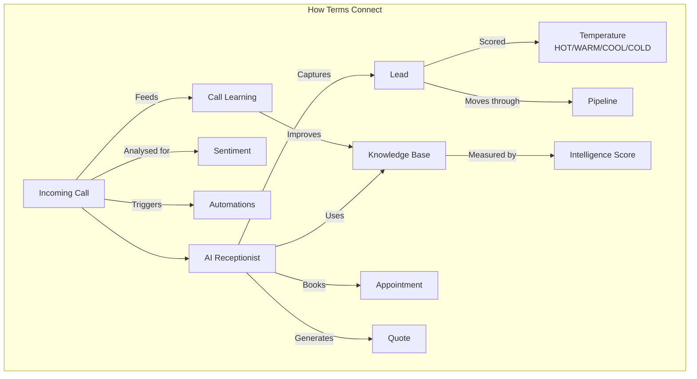

## Business Terms

| Term | What It Means |
|------|---------------|
| **AI Receptionist** | Your virtual phone answerer — sounds like a real person, available 24/7. [Set yours up](/getting-started/first-10-minutes) |
| **Lead** | Someone who called and gave their information (name, phone, what they need). [View leads](/features/leads) |
| **Booking / Appointment** | A time slot the AI scheduled for you with a customer. [Manage appointments](/features/appointments) |
| **Quote** | A price estimate sent to a customer after a call. [Learn about quotes](/features/quotes) |
| **Conversion Rate** | The percentage of calls that turn into leads or bookings |
| **Pipeline** | A visual board (like a Kanban) showing where each lead or quote sits in your sales process — from new enquiry to won or lost |
| **Escalation** | When the AI transfers a caller to a real person because the request is beyond what it can handle, or the caller asks for a human |

## AI & Voice Terms

| Term | What It Means |
|------|---------------|
| **Knowledge Base** | Everything your AI knows about your business — services, prices, hours, FAQs. [Manage KB](/ai-receptionist/knowledge-base) |
| **Intelligence Score** | A 0-100 rating of how well-informed your AI is, weighted by category importance (services 20%, pricing 15%, hours 15%, etc.). [Learn more](/ai-receptionist/knowledge-base) |
| **Call Learning** | After every call, the AI analyses the transcript for questions it could not answer well, then suggests new Knowledge Base articles for you to review and approve |
| **Sentiment** | How the caller felt during the call — positive, neutral, or negative (AI-detected) |
| **Temperature** | How likely a lead is to convert — HOT (very likely), WARM, COOL, COLD (unlikely). [View leads](/features/leads) |
| **Personality** | The tone and style of your AI — Professional, Friendly, Enthusiastic, or Calm. [Choose personality](/ai-receptionist/personality) |
| **Squad / Smart Routing** | Multiple AI specialists handling different parts of a call (booking, pricing, transfer). [Learn about squads](/ai-receptionist/smart-routing) |
| **IVR** | Interactive Voice Response — menu options offered to callers at the start of a call |
| **Workflow Builder** | A visual tool for creating automated sequences of actions triggered by events like missed calls, new leads, or completed bookings |

## Technical Terms

| Term | What It Means |
|------|---------------|
| **Call Forwarding** | Redirecting your existing phone calls to your AI number. [Set up forwarding](/getting-started/call-forwarding) |
| **Routing Mode** | How calls are handled — AI answers all, ring you first, or schedule-based. [Choose mode](/getting-started/call-forwarding) |
| **Automation** | Something that happens automatically, like texting a customer after a missed call. [View automations](/automations/overview) |
| **CRM** | Customer Relationship Management — tools like HubSpot, Salesforce, GoHighLevel. [Connect CRM](/integrations/overview) |
| **Webhook** | A way for systems to talk to each other automatically — you don't need to know this |
| **VAPI** | The AI voice technology powering your receptionist — you don't need to know this |
| **Twilio** | The phone system powering your AI number — you don't need to know this |

## Legal & Compliance Terms

| Term | What It Means |
|------|---------------|
| **SMS Opt-Out** | When a customer texts STOP, they won't receive more texts from your number |
| **TCPA** | US law requiring consent before recording calls — your AI can ask automatically |
| **HIPAA** | Healthcare privacy rules — enable this if you're a medical or dental practice |
| **GDPR** | European data protection regulation — accounts deleted after 30-day grace period on request |

