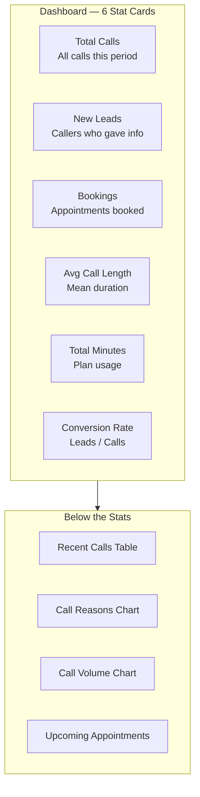

## Your Dashboard at a Glance

When you log in to your [dashboard](https://app.closethecall.com/dashboard), you'll see six key numbers. Here's what each one means and what's "good."

| Metric | What It Means | Good Range |
|--------|--------------|------------|
| **Total Calls** | Every call your AI handled this period | Depends on your marketing |
| **New Leads** | People who gave their name + phone number | 15-30% of total calls |
| **Bookings** | Appointments booked by the AI | 5-15% of total calls |
| **Avg Call Length** | How long each conversation lasts | 0:30 - 2:00 minutes |
| **Total Minutes** | Minutes used from your plan this month | Check against your plan limit |
| **Conversion Rate** | Leads captured / Total calls | 15-30% is good, 30%+ is great |

<Tip>
If your **average call length is under 15 seconds**, callers might be hanging up on your greeting. Try making it shorter and friendlier.
</Tip>

## The Getting Started Checklist

New accounts see a progress bar with 4 steps:

1. **AI phone number provisioned** — done automatically
2. **Customise your greeting** — go to Receptionist Settings
3. **Knowledge base set up** — add at least 3 articles
4. **Make your first test call** — call your AI number

<Info>
The checklist disappears once all 4 steps are complete. You can dismiss it early by clicking "Dismiss."
</Info>

## The AI Status Indicator

The green bar below the checklist shows:
- **AI Receptionist is Live** + your phone number — everything is working
- **AI Receptionist is Offline** — there's a problem with your setup

If offline, check that your VAPI assistant was created successfully during onboarding.

## Date Range Selector

Use the **7d / 14d / 30d / 90d** buttons to change the time period for all stats and charts. Default is 30 days.

## Recent Calls Table

Shows your most recent calls with:
- **Time** — when the call happened
- **Caller** — name (if captured) + phone number
- **Duration** — how long the call lasted
- **Type** — inbound or outbound
- **Reason** — what the caller wanted (AI-detected)
- **Lead Score** — temperature badge (HOT/WARM/COOL/COLD)
- **Action Required** — whether you need to follow up

## Frequently Asked Questions

<AccordionGroup>
  <Accordion title="What's a good conversion rate?">
    A conversion rate of **15-30%** is solid for most service businesses. Above 30% is excellent. If yours is below 10%, check your Knowledge Base — the AI might be missing key information about your services or pricing that would help convert callers into leads.
  </Accordion>
  <Accordion title="How often does data refresh?">
    Dashboard data refreshes **every time you load the page**. Stats are calculated live from your call data — there is no delay or caching. If you are on the page during a call, refresh after the call ends to see updated numbers.
  </Accordion>
  <Accordion title="Can I export dashboard data?">
    Currently, you can view detailed call and lead data in the **Calls** and **Leads** pages. CSV export is available on the Agency Analytics page. For individual call records, click into any call to see the full transcript and details.
  </Accordion>
  <Accordion title="What does the getting started checklist do?">
    The checklist guides you through the 4 essential setup steps: phone provisioning, greeting customisation, knowledge base setup, and your first test call. Completing all 4 steps ensures your AI receptionist is fully configured and ready for real customer calls. It auto-hides once complete, or you can dismiss it manually.
  </Accordion>
</AccordionGroup>
