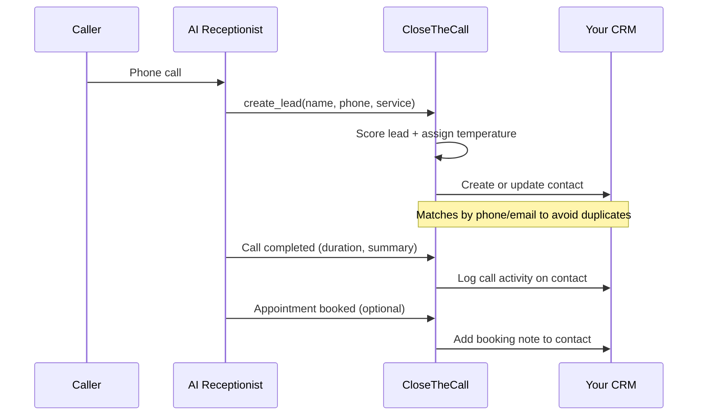

If you already use a CRM (Customer Relationship Management) tool to track your customers, you can connect it to CloseTheCall so every lead and call is synced automatically. No more copying names and phone numbers from one system to another.

We support three CRMs:

<CardGroup cols={3}>
  <Card title="HubSpot" icon="hubspot">
    Free and paid plans. Most popular with small businesses.
  </Card>
  <Card title="Salesforce" icon="salesforce">
    Enterprise-grade CRM. Common in larger organisations.
  </Card>
  <Card title="GoHighLevel" icon="chart-line">
    All-in-one marketing platform. Popular with agencies and contractors.
  </Card>
</CardGroup>

## How CRM sync works

## What CRM Sync Does

When the AI captures a lead or logs a call, the following happens automatically:

| Action | What Gets Created in Your CRM |
|--------|------------------------------|
| **New lead captured** | A new contact/lead record with name, phone, email, and service needed |
| **Call completed** | A call activity/task logged against the contact with duration, summary, and outcome |
| **Appointment booked** | A note or task added to the contact with booking details |

<Tip>
CRM sync happens in real time — within seconds of the call ending. You don't need to do anything. Open your CRM and the new contact is already there.
</Tip>

---

## Connecting HubSpot

HubSpot uses a **Private App access token** (OAuth2-based) for authentication. This is more secure than a simple API key — the token is scoped to only the permissions CloseTheCall needs.

<Steps>
  <Step title="Go to Integrations">
    Click **Integrations** in the sidebar.
  </Step>
  <Step title="Find HubSpot">
    Click **Connect** on the HubSpot card.
  </Step>
  <Step title="Enter your Private App access token">
    Paste your HubSpot Private App access token. To create one: go to HubSpot > Settings > Integrations > Private Apps > Create a private app. Give it **Contacts** and **CRM** read/write scopes. Copy the access token.
  </Step>
  <Step title="Click Save">
    The integration will test the connection. If successful, you'll see a green **Connected** badge.
  </Step>
</Steps>

<Accordion title="How do I create a HubSpot Private App?">
  1. Log into HubSpot
  2. Click the gear icon (Settings) in the top right
  3. Go to **Integrations > Private Apps**
  4. Click **Create a private app**
  5. Name it "CloseTheCall"
  6. Under Scopes, enable: `crm.objects.contacts.read`, `crm.objects.contacts.write`
  7. Click **Create app**, then copy the access token

  This is a Private App token using HubSpot's OAuth2 infrastructure, not a legacy API key. HubSpot deprecated simple API keys in November 2022. The Private App approach gives you granular control over which permissions CloseTheCall has.
</Accordion>

---

## Connecting Salesforce

<Steps>
  <Step title="Go to Integrations">
    Click **Integrations** in the sidebar.
  </Step>
  <Step title="Find Salesforce">
    Click **Connect** on the Salesforce card.
  </Step>
  <Step title="Enter your credentials">
    You'll need three things from your Salesforce Connected App:
    - **Client ID** (Consumer Key)
    - **Client Secret** (Consumer Secret)
    - **Instance URL** (e.g. `https://yourcompany.my.salesforce.com`)
  </Step>
  <Step title="Click Save">
    The integration tests the connection using OAuth. Green badge means you're connected.
  </Step>
</Steps>

<Accordion title="How do I create a Salesforce Connected App?">
  1. Log into Salesforce
  2. Go to **Setup > App Manager > New Connected App**
  3. Enable OAuth Settings
  4. Add callback URL: `https://api.closethecall.com/api/integrations/salesforce/callback`
  5. Select scopes: `api`, `refresh_token`
  6. Save and wait 10 minutes for it to activate
  7. Copy the Consumer Key and Consumer Secret
</Accordion>

---

## Connecting GoHighLevel

<Steps>
  <Step title="Go to Integrations">
    Click **Integrations** in the sidebar.
  </Step>
  <Step title="Find GoHighLevel">
    Click **Connect** on the GoHighLevel card.
  </Step>
  <Step title="Enter your API key and Location ID">
    - **API Key**: Found in GHL Settings > Business Profile > API Key
    - **Location ID**: Found in your GHL URL — it's the string after `/location/`
  </Step>
  <Step title="Click Save">
    Connection is tested automatically. Green badge confirms it's working.
  </Step>
</Steps>

---

## What Fields Sync

| CloseTheCall Field | HubSpot | Salesforce | GoHighLevel |
|-------------------|---------|------------|-------------|
| Name | First Name + Last Name | Name | Contact Name |
| Phone | Phone | Phone | Phone |
| Email | Email | Email | Email |
| Service needed | Custom property | Description | Tags |
| Lead temperature | Custom property | Rating | Tags |
| Call summary | Note | Task | Note |
| Call duration | Note | Task | Note |

<Info>
If a contact already exists in your CRM (matched by phone number or email), CloseTheCall updates the existing record instead of creating a duplicate.
</Info>

## How to Disconnect

For any CRM:

<Steps>
  <Step title="Go to Integrations">
    Click **Integrations** in the sidebar.
  </Step>
  <Step title="Click Disconnect">
    On the CRM card, click **Disconnect**.
  </Step>
  <Step title="Confirm">
    Click **Yes, disconnect**. Your existing CRM data is not affected — disconnecting only stops future syncing.
  </Step>
</Steps>

<Warning>
After disconnecting, new leads and calls will no longer sync to your CRM. You'll need to reconnect to resume syncing. Historical data that was already synced stays in your CRM.
</Warning>

<Accordion title="Can I connect more than one CRM?">
  Yes. You can connect all three at once if you want. Every lead and call will sync to all connected CRMs simultaneously.
</Accordion>

<Accordion title="What if a lead is already in my CRM?">
  CloseTheCall matches by phone number and email. If a match is found, it updates the existing contact rather than creating a duplicate.
</Accordion>

<Accordion title="Do I need a paid CRM plan?">
  HubSpot's free plan works fine (Private Apps are available on all tiers). Salesforce requires a paid plan with API access. GoHighLevel requires any active subscription.
</Accordion>

---

<Card title="Connect your CRM" icon="arrow-up-right-from-square" href="https://app.closethecall.com/integrations">
  Open the Integrations page to connect HubSpot, Salesforce, or GoHighLevel.
</Card>
