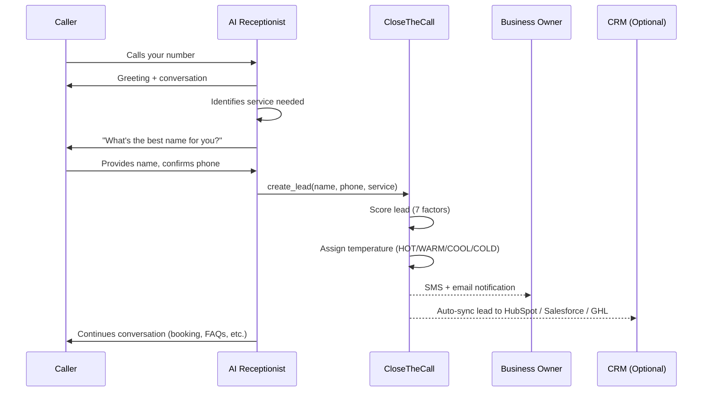

Every phone call to your business is a potential customer. Your AI receptionist captures their details automatically during the conversation — no forms, no voicemail, no missed opportunities.

## Lead capture flow



## What Happens During the Call

Your AI receptionist gathers lead information naturally, as part of a normal conversation. It doesn't sound like a survey — it sounds like a helpful member of your team.

<Steps>
  <Step title="Customer calls your number">
    The AI answers with your custom greeting, e.g. "Hi, thanks for calling Smith Plumbing! How can I help you today?"
  </Step>
  <Step title="AI identifies the service needed">
    Based on what the caller describes, the AI works out which of your services they need. "Sounds like you need a boiler repair — we can definitely help with that."
  </Step>
  <Step title="AI captures contact details">
    The AI asks for the caller's name, phone number (confirmed from caller ID), and email address. It keeps it conversational: "And what's the best name for you?" rather than "State your full name."
  </Step>
  <Step title="AI assesses urgency">
    From the conversation, the AI picks up on urgency signals — words like "emergency," "flooding," "no hot water" push the lead score higher automatically.
  </Step>
  <Step title="Lead is created">
    All the information is saved as a new lead in your dashboard before the call even ends.
  </Step>
</Steps>

<Info>
The AI captures leads even when it also books an appointment. You get both — the lead record for tracking and the appointment for scheduling.
</Info>

## What Happens After the Call

Once the call ends, several things happen automatically within seconds:

<CardGroup cols={2}>
  <Card title="Lead appears in dashboard" icon="chart-column">
    The new lead shows up on your Lead Board in the **New** column, complete with name, phone, service needed, and AI-generated temperature score.
  </Card>
  <Card title="You get notified" icon="bell">
    You receive an SMS and/or email notification with the lead details. Configure which notifications you want in **Settings > Notifications**.
  </Card>
  <Card title="CRM auto-sync" icon="rotate">
    If you've connected HubSpot, Salesforce, or GoHighLevel, the lead is automatically created there too — no double entry.
  </Card>
  <Card title="Follow-up automation" icon="robot">
    If you have the **Estimate Follow-up** automation enabled, the AI will send a personalised follow-up SMS to the caller after a delay you set.
  </Card>
</CardGroup>

## What the AI Captures

Every lead record includes:

| Field | How It's Captured |
|-------|------------------|
| **Name** | Asked during the call |
| **Phone number** | From caller ID, confirmed by the AI |
| **Email** | Asked during the call (optional) |
| **Service needed** | Identified from the conversation |
| **Urgency** | Assessed from language and tone |
| **Temperature** | Scored automatically (HOT/WARM/COOL/COLD) |
| **Call recording** | Full recording and transcript stored |
| **AI summary** | One-paragraph summary of what they need |

<Tip>
If a caller doesn't want to give their name or email, the AI won't push. It will still create a lead with whatever information is available — even a phone number alone is enough for you to call them back.
</Tip>

## Lead detail panel

Here is what a lead looks like when you click on it in the dashboard:

```
+----------------------------------------------------------+
|  Sarah Johnson                          Temperature: HOT  |
|  +447700900123  |  sarah@email.com                       |
+----------------------------------------------------------+
|                                                          |
|  Service: Boiler repair                                  |
|  Score: 87/100                                           |
|  Source: Phone call (2 min 34s)                          |
|  Created: 15 Mar 2026, 10:32am                           |
|                                                          |
|  AI Summary:                                             |
|  Customer has a leaking boiler in the kitchen. Needs     |
|  urgent repair. Available Tuesday or Wednesday morning.  |
|                                                          |
+----------------------------------------------------------+
|  [Call Lead]  [Send Email]  [Send SMS]  [Convert to Apt] |
+----------------------------------------------------------+
|                                                          |
|  Call History (2 calls)                                   |
|  - 15 Mar 10:32am  Inbound  2m34s  "Boiler leaking..."  |
|  - 12 Mar 14:15pm  Inbound  1m12s  "General enquiry..." |
|                                                          |
+----------------------------------------------------------+
```

## Quick Actions

When you open any lead from the dashboard, you'll see four action buttons:

<Steps>
  <Step title="Call Lead">
    Click to call the customer back through your AI phone number. The call shows your business number on their phone, not your personal mobile.
  </Step>
  <Step title="Send Email">
    Opens a compose window to send a follow-up email. The email is sent via your business email through Postmark — professional and reliable.
  </Step>
  <Step title="Send SMS">
    Send a quick text to the customer. Great for "Hi, just following up on your call about the boiler repair — when works for you?"
  </Step>
  <Step title="Convert to Appointment">
    Turn the lead into a booked appointment in one click. It pre-fills the customer's name, phone, and service from the lead.
  </Step>
</Steps>

## Returning Callers

When someone who has called before rings again, your AI recognises them automatically.

- The AI greets them by name: "Hi Sarah! Thanks for calling back."
- Their existing lead is updated (not duplicated) with the new call details.
- You can see their full call history on the lead detail page.

<Warning>
Lead capture requires the **Capture Lead Info** toggle to be enabled in your Receptionist Settings. If it's turned off, the AI will still answer calls but won't ask for or store contact details.
</Warning>

## How Lead Scoring Works

Every lead gets an automatic temperature score from 0 to 100, calculated from 7 factors during the call. See the [Lead Board](/leads-customers/lead-board) article for the full breakdown of scoring factors and what each temperature means.

## Frequently asked questions

<Accordion title="Can I turn off lead capture for certain calls?">
  The AI captures leads on every call by default. If you want it to only answer questions without collecting details (e.g. for FAQ-only mode), turn off **Capture Lead Info** in Receptionist Settings.
</Accordion>

<Accordion title="What if the AI gets a detail wrong?">
  You can edit any lead from the dashboard. Click the lead, then click **Edit** to update the name, phone, email, service, or notes. Your edits are always preserved — even if the same person calls again.
</Accordion>

<Accordion title="Do leads ever get deleted automatically?">
  No. Leads are kept permanently unless you delete them manually. If you have HIPAA mode enabled, call transcripts may be purged after your configured retention period, but the lead record itself stays.
</Accordion>

<Accordion title="How quickly do leads appear after a call?">
  Leads are created during the call itself — before it even ends. By the time you check your dashboard, the lead is already there with all captured details, score, and temperature. CRM sync and notifications fire within 5 seconds of the call ending.
</Accordion>

---

<Card title="View your leads" icon="arrow-up-right-from-square" href="https://app.closethecall.com/leads">
  Open the Lead Board to see all captured leads, scores, and take action.
</Card>
