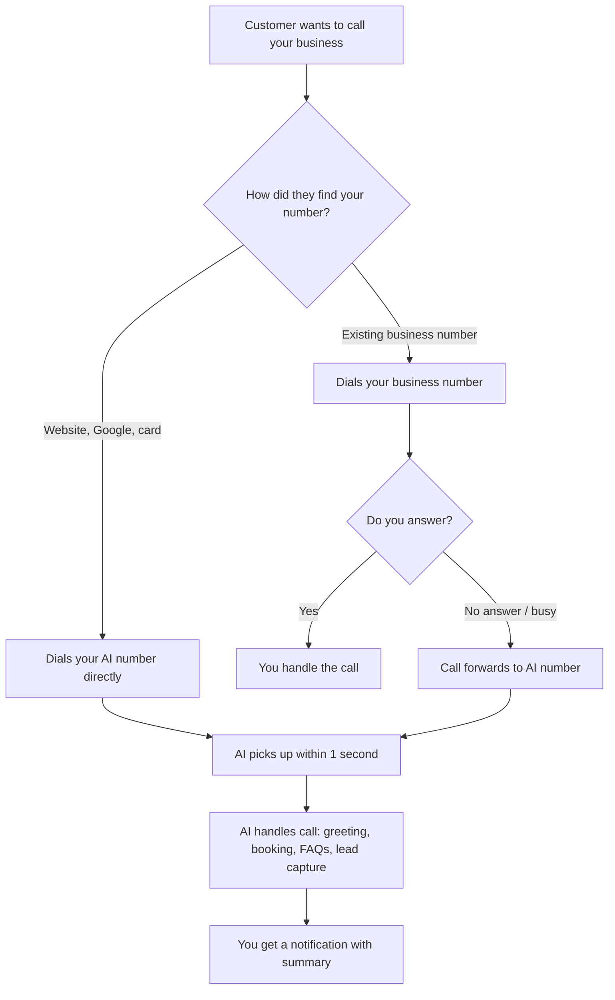

## What is your AI phone number?

When you sign up for CloseTheCall, we give you a dedicated phone number that your AI receptionist answers. This is a real phone number — callers dial it and your AI picks up, just like a human receptionist would.

You can find your AI phone number by clicking **Phone** in the left sidebar of your dashboard. It is displayed prominently at the top of the page.

## Types of AI phone numbers

Depending on your country and preferences, you will get one of these number types:

<CardGroup cols={2}>
  <Card title="UK Mobile" icon="mobile">
    **Starts with +447**

    A standard UK mobile number. Callers pay their normal mobile rate. Works well for tradespeople and businesses where customers expect to call a mobile.
  </Card>
  <Card title="UK Landline" icon="phone-office">
    **Starts with +441, +442, or +443**

    A local area code number (e.g. +44 161 for Manchester, +44 20 for London). Looks more established and professional. Callers pay local rate.
  </Card>
  <Card title="US Local" icon="flag-usa">
    **Starts with +1**

    A US local number with your area code (e.g. +1 212 for New York, +1 310 for Los Angeles). Callers see a familiar local number.
  </Card>
  <Card title="Australian" icon="globe">
    **Starts with +61**

    An Australian local or mobile number. Mobile numbers start with +614, landlines use area codes like +612 (Sydney) or +613 (Melbourne). Callers see a local Australian number.
  </Card>
</CardGroup>

<Info>
Your AI phone number is assigned during setup based on your location. We try to match your local area code so callers see a familiar number. If you need a specific area code, contact support.
</Info>

## How calls reach your AI

## Where to put your AI phone number

Your AI number works best when it is the number customers call when you cannot pick up. Here are the most effective places to display it:

### On your website

<Steps>
  <Step title="Header and footer">
    Add your AI number as a click-to-call link in your website header. This is where most people look for a phone number.
  </Step>
  <Step title="Contact page">
    List it on your contact page with a note like "Call us anytime — our AI assistant is available 24/7."
  </Step>
  <Step title="Service pages">
    Add it to individual service pages with a call-to-action like "Need a quote? Call now."
  </Step>
</Steps>

### On Google Business Profile

Update your Google Business Profile (Google Maps listing) with your AI number. This is one of the highest-traffic sources of phone calls for local businesses.

### On business cards and printed materials

Add the number to business cards, flyers, van signage, and any printed material. Consider adding both your personal number and the AI number:

> **Dave: 07700 900123** (direct)
> **Office: 0161 496 0987** (AI receptionist, available 24/7)

### On social media

Add the number to your Facebook page, Instagram bio, and any other social profiles where customers might look for your contact details.

## Direct calls vs forwarded calls

There are two ways callers can reach your AI receptionist:

<CardGroup cols={2}>
  <Card title="Direct calls" icon="phone-arrow-right">
    **Caller dials your AI number directly**

    The caller sees your AI number (on your website, Google listing, etc.) and dials it. The AI picks up immediately.

    This is the simplest setup — just put your AI number wherever customers look for your phone number.
  </Card>
  <Card title="Forwarded calls" icon="phone-arrow-down-left">
    **Caller dials your existing number, which forwards to the AI**

    The caller dials your current business number. When you do not answer (or always), the call is forwarded to your AI number by your phone carrier.

    This lets you keep your existing number and use the AI as a backup.
  </Card>
</CardGroup>

<Tip>
Most businesses use a combination: direct calls from their website and Google listing, plus call forwarding from their existing number for missed calls. This gives you maximum coverage.
</Tip>

## Sharing your AI number

On the **Phone** page in your dashboard, you will find a **Share** section with:

- A copyable phone number (click to copy)
- The number formatted for display on your website
- A QR code that callers can scan to dial your number

## Things to know about your AI number

- **It is yours for as long as you are subscribed.** The number stays the same month to month.
- **Callers see this number on their phone.** When the AI sends SMS confirmations, they come from this number too.
- **You can have multiple numbers** on Growth and Scale plans (up to 2 and 5 respectively).
- **Numbers are real phone numbers** registered with the phone network. They are not VoIP-only — they work with any phone.

<Warning>
If you cancel your subscription, your AI phone number is released after 30 days. If you resubscribe later, you may get a different number. Make sure to update your website and listings if this happens.
</Warning>

## Getting a second number

On Growth and Scale plans, you can provision additional numbers. This is useful if you want:

- A separate number for each location
- Both a mobile and a landline number
- Different numbers for different marketing channels (to track which ads drive calls)

Go to **Phone** in your dashboard and click **Add Number** to provision an additional line.

## Frequently asked questions

<Accordion title="Can I port my existing phone number to CloseTheCall?">
Not at this time. We provision new numbers for you. The recommended approach is to keep your existing number and set up call forwarding so unanswered calls go to your AI number. This way you keep your existing number and get AI backup at the same time.
</Accordion>

<Accordion title="Can I change my area code after setup?">
Yes. Contact support and we can provision a new number with a different area code. Your old number will be released, so make sure to update your website, Google listing, and any printed materials before switching.
</Accordion>

<Accordion title="What happens to my number if I cancel?">
Your number is held for 30 days after cancellation. If you resubscribe within that window, you get the same number back. After 30 days, the number is released back to the pool and may be assigned to someone else.
</Accordion>

<Accordion title="Do I keep my number when changing plans?">
Yes. Upgrading or downgrading your plan does not affect your phone number. It stays the same regardless of which plan you are on.
</Accordion>

---

<Card title="View your AI phone number" icon="arrow-up-right-from-square" href="https://app.closethecall.com/phone">
  Open the Phone page to see your number, share it, or provision additional lines.
</Card>
