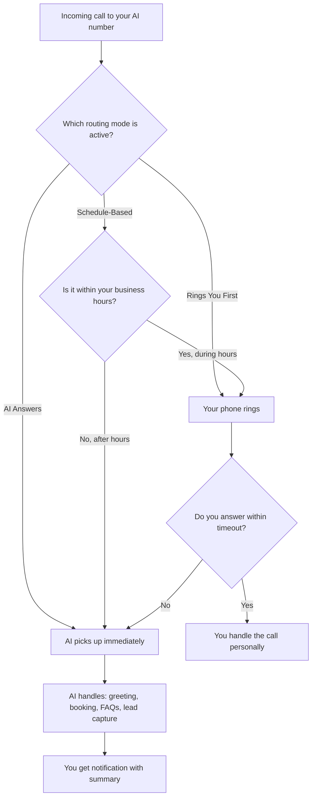

## How call routing works

When someone calls your AI phone number, CloseTheCall needs to decide: should the AI answer immediately, should it try ringing you first, or should it depend on the time of day? This is what routing modes control.

You have three options:

<CardGroup cols={3}>
  <Card title="AI Answers" icon="robot">
    AI picks up every call immediately. You never get rung.
  </Card>
  <Card title="Rings You First" icon="phone-arrow-up-right">
    Your phone rings first. If you do not answer, the AI takes over.
  </Card>
  <Card title="Schedule-Based" icon="calendar-clock">
    During business hours, your phone rings. After hours, AI answers.
  </Card>
</CardGroup>

## Routing decision tree



---

## Mode 1: AI Answers

The simplest mode. Every call goes directly to your AI receptionist. Your personal phone never rings.

### How it works

1. Caller dials your AI number
2. AI picks up within 1 second
3. AI handles the entire call (greeting, booking, FAQs, lead capture)
4. You get a notification after the call with a summary

### Best for

- Businesses that want **24/7 coverage** without interruptions
- Owners who are **busy on jobs** all day (plumbers, electricians, builders)
- **After-hours overflow** when you do not want to be disturbed
- Businesses that get **high call volumes** and cannot answer them all

### Pros and cons

| Pros | Cons |
|------|------|
| Never miss a call, ever | You never speak to callers directly |
| Consistent experience for every caller | Some callers prefer speaking to a human |
| AI handles everything — you focus on work | No personal touch |
| Works 24/7 including weekends and holidays | |

<Tip>
This is the most popular mode. If you are a sole trader or small team who is often on jobs, this mode means you never miss a potential customer while you are up a ladder or under a sink.
</Tip>

---

## Mode 2: Rings You First

Your phone rings for a set number of seconds. If you do not answer, the AI takes over. You get first chance at every call, with the AI as your safety net.

### How it works

1. Caller dials your AI number
2. **Your phone rings** for your chosen duration (5 to 30 seconds)
3. **If you answer** — you talk to the caller directly, AI is not involved
4. **If you do not answer** — AI picks up and handles the call

### Setting the ring duration

You choose how long your phone rings before the AI takes over:

| Duration | Rings (approx.) | Good for |
|----------|-----------------|----------|
| **5 seconds** | 1-2 rings | Quick fallback — barely try before AI answers |
| **10 seconds** | 3 rings | Short window — grab it if you are near your phone |
| **15 seconds** | 4-5 rings | Standard — enough time to finish what you are doing |
| **20 seconds** | 6 rings | Generous — plenty of time to get to your phone |
| **30 seconds** | 9-10 rings | Maximum — caller waits a while before AI answers |

<Info>
We recommend 15 seconds for most businesses. It gives you enough time to answer if you are nearby, without making the caller wait too long if you are not.
</Info>

### Best for

- Businesses that **prefer to answer personally** but want a safety net
- **Office-based businesses** where someone is usually near the phone
- Owners who want to **screen calls** — answer the important ones, let AI handle the rest

### Pros and cons

| Pros | Cons |
|------|------|
| Personal touch when you are available | Callers wait longer before getting help |
| AI catches what you miss | You get interrupted by every call |
| Best of both worlds | Inconsistent experience (sometimes human, sometimes AI) |

### How to set your transfer number

<Steps>
  <Step title="Go to Phone">
    Click **Phone** in the left sidebar.
  </Step>
  <Step title="Select Rings You First mode">
    In the **Routing Mode** section, click **Rings You First**.
  </Step>
  <Step title="Enter your phone number">
    Type the phone number you want to ring (your mobile, office line, etc.).
  </Step>
  <Step title="Set the ring duration">
    Use the slider or dropdown to choose how many seconds your phone rings before the AI takes over.
  </Step>
  <Step title="Save">
    Click **Save**. The next incoming call will ring your phone first.
  </Step>
</Steps>

<Warning>
Make sure you enter a phone number that is different from your AI phone number. If you enter the AI number itself, it creates a loop and the call will fail.
</Warning>

---

## Mode 3: Schedule-Based

The smart hybrid. During your business hours, calls ring your phone (like Rings You First). Outside your hours, the AI answers immediately (like AI Answers).

### How it works

1. Caller dials your AI number
2. The system checks the **current time** against your **weekly schedule**
3. **During business hours** — your phone rings first, AI takes over if no answer
4. **Outside business hours** — AI answers immediately

### Setting up your schedule

You set your hours on a 7-day grid. Each day has an "open" and "close" time, or can be marked as closed entirely.

<Steps>
  <Step title="Go to Phone">
    Click **Phone** in the left sidebar.
  </Step>
  <Step title="Select Schedule-Based mode">
    In the **Routing Mode** section, click **Based on Schedule**.
  </Step>
  <Step title="Set your hours">
    A 7-day grid appears. For each day:
    - Set the **start time** (e.g. 08:00)
    - Set the **end time** (e.g. 18:00)
    - Or toggle the day **off** if you are closed
  </Step>
  <Step title="Set your timezone">
    Select your timezone from the dropdown. This ensures the schedule matches your local time, even during daylight saving changes.
  </Step>
  <Step title="Enter your phone number">
    Enter the phone number to ring during business hours.
  </Step>
  <Step title="Save">
    Click **Save**. The routing switches automatically based on your schedule.
  </Step>
</Steps>

### 7-day schedule grid

Here is what the schedule grid looks like in your dashboard:

```
+----------+--------+---------+---------+------------------+
|   Day    | Active |  Start  |   End   |     Routing      |
+----------+--------+---------+---------+------------------+
| Monday   |  [x]   |  08:00  |  18:00  | Rings you first  |
| Tuesday  |  [x]   |  08:00  |  18:00  | Rings you first  |
| Wednesday|  [x]   |  08:00  |  13:00  | Rings you first  |
| Thursday |  [x]   |  08:00  |  18:00  | Rings you first  |
| Friday   |  [x]   |  08:00  |  17:00  | Rings you first  |
| Saturday |  [ ]   |   --    |   --    | AI answers all   |
| Sunday   |  [ ]   |   --    |   --    | AI answers all   |
+----------+--------+---------+---------+------------------+
| Timezone: [Europe/London           v]                    |
+----------------------------------------------------------+
```

### Example schedule

| Day | Hours | What happens |
|-----|-------|-------------|
| Monday | 08:00 - 18:00 | Rings you during these hours, AI answers outside |
| Tuesday | 08:00 - 18:00 | Same |
| Wednesday | 08:00 - 13:00 | Half day — AI takes over after 1pm |
| Thursday | 08:00 - 18:00 | Rings you |
| Friday | 08:00 - 17:00 | Early finish — AI takes over after 5pm |
| Saturday | Closed | AI answers all day |
| Sunday | Closed | AI answers all day |

### Best for

- Businesses with **regular hours** and a receptionist or office during the day
- Owners who want to **answer personally during work hours** but not be disturbed evenings and weekends
- **Practices and clinics** with set opening times

### Pros and cons

| Pros | Cons |
|------|------|
| Smart automation — different behaviour at different times | Requires you to keep the schedule updated |
| Personal service during hours, AI coverage outside | More complex than the other two modes |
| Callers always get a quick response | Schedule changes (holidays, etc.) need manual updates |

<Tip>
Do not forget to update your schedule for holidays and bank holidays. If you are closed on Christmas Day but your schedule says you are open, the AI will try to ring you before answering.
</Tip>

---

## How to switch between modes

<Steps>
  <Step title="Go to Phone">
    Click **Phone** in the left sidebar.
  </Step>
  <Step title="Choose your mode">
    In the **Routing Mode** section, you will see three options: **AI Answers**, **Rings You First**, and **Based on Schedule**. Click the one you want.
  </Step>
  <Step title="Configure if needed">
    If you chose Rings You First, enter your phone number and ring duration. If you chose Schedule-Based, set up your weekly grid.
  </Step>
  <Step title="Save">
    Click **Save**. The change takes effect on the next incoming call.
  </Step>
</Steps>

<Info>
You can switch modes at any time. Switching does not affect your other settings (greeting, voice, Knowledge Base, etc.). It only changes how incoming calls are routed.
</Info>

## Which mode should I choose?

| Your situation | Recommended mode |
|---------------|-----------------|
| Sole trader, always on jobs | **AI Answers** |
| Small team, someone usually in the office | **Rings You First** (15 seconds) |
| Regular business hours with evening/weekend closure | **Schedule-Based** |
| Just want it to work with zero effort | **AI Answers** |
| Want to answer VIP clients personally | **Rings You First** (20 seconds) |
| Dental/medical practice with reception desk | **Schedule-Based** |

<Warning>
If you are just getting started, pick **AI Answers** to keep things simple. You can always switch to a more advanced mode once you are comfortable with how the AI handles calls.
</Warning>

## Frequently asked questions

<Accordion title="Can I change routing modes mid-week?">
Yes. You can switch between AI Answers, Rings You First, and Schedule-Based at any time. The change takes effect on the very next incoming call. There is no waiting period and your other settings (greeting, voice, Knowledge Base) are not affected.
</Accordion>

<Accordion title="How do I handle holidays and bank holidays?">
For Schedule-Based mode, you need to manually update your schedule for holidays. Toggle the day off in the 7-day grid before the holiday. Alternatively, switch temporarily to AI Answers mode for the holiday period and switch back when you return.
</Accordion>

<Accordion title="Does Rings You First work with IVR?">
Yes. When IVR is enabled alongside Rings You First, the flow is: your phone rings first, and if you do not answer, the AI picks up and offers the IVR phone menu. The caller then speaks their choice and the AI routes them accordingly.
</Accordion>

<Accordion title="What is the default ring timeout for Rings You First?">
The default ring timeout is **15 seconds** (approximately 4-5 rings). You can adjust this from 5 seconds (1-2 rings) up to 30 seconds (9-10 rings) using the slider on the Phone settings page.
</Accordion>

---

<Card title="Configure your routing mode" icon="arrow-up-right-from-square" href="https://app.closethecall.com/phone">
  Open the Phone page to choose your routing mode and configure the schedule.
</Card>
