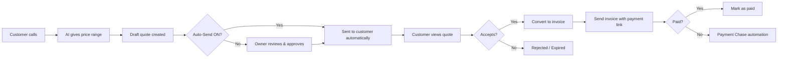

When a customer calls and asks "How much does that cost?", your AI receptionist gives them a price range and creates a draft quote for you to review. Once approved, the customer can accept via a branded link, and you can convert it straight into an invoice.

## The Full Lifecycle

## How the AI Handles Pricing Calls

<Steps>
  <Step title="Customer asks about pricing">
    The caller says something like "How much for a boiler service?" or "What do you charge for a cut and colour?"
  </Step>
  <Step title="AI gives a price range">
    Based on the pricing in your business settings, the AI responds with a range: "A boiler service typically runs between 80 and 120 pounds, depending on the make and model."
  </Step>
  <Step title="AI adds a disclaimer">
    The AI always follows up with: "That's an estimate -- we'd need to take a look before giving you a firm price." This protects you from being held to a number.
  </Step>
  <Step title="Draft quote is created">
    If the AI captured enough details (service, name, phone), a draft quote is created in your dashboard with auto-generated line items.
  </Step>
</Steps>

<Warning>
The AI will **never** give a fixed price -- only a range. This is by design. The AI explains this to the customer on every pricing call. Five safety mitigations are built in: price RANGE only, legal disclaimer, service cross-reference against your knowledge base, zero-price quotes blocked from sending, and draft-approve by default.
</Warning>

## Quote Statuses

| Status | What It Means |
|--------|--------------|
| **Draft** | Created by the AI or by you. Not sent to the customer yet. Fully editable. |
| **Sent** | Delivered to the customer by email or SMS. They can view it via a branded link. |
| **Viewed** | The customer has opened the quote link. |
| **Accepted** | The customer agreed. Time to book the job or convert to invoice. |
| **Rejected** | The customer declined. Follow up or move on. |
| **Expired** | Passed the validity date (default: 14 days) without a response. |

## Creating a Quote Manually

Not every quote comes from a phone call. You can create one from scratch.

<Steps>
  <Step title="Go to Quotes">
    Click **Quotes & Invoices** in the sidebar, or go to [app.closethecall.com/quotes](https://app.closethecall.com/quotes).
  </Step>
  <Step title="Click + New Quote">
    Click the button at the top right.
  </Step>
  <Step title="Add line items">
    Each line item has a description, quantity, and unit price. Add as many as you need. The total calculates automatically.
  </Step>
  <Step title="Configure tax">
    Toggle tax on/off and set your rate (e.g. 20% VAT for UK, sales tax for US). Tax is calculated and shown as a separate line.
  </Step>
  <Step title="Save as Draft">
    The quote is saved with an auto-generated number (e.g. `QUO-2026-0001`). Numbers increment automatically and never repeat.
  </Step>
  <Step title="Review and send">
    Open the draft, check everything, and click **Send Quote**. The customer receives a branded email with a link to view, accept, or decline.
  </Step>
</Steps>

### Auto-Numbering

Every quote gets a unique sequential number in the format `QUO-YYYY-NNNN`. The year resets the counter. You never need to manage quote numbers yourself.

### Currency Auto-Detection

The currency symbol (GBP or USD) is automatically set based on your business's country. UK businesses see prices in pounds, US businesses in dollars. This applies to both quotes and invoices.

## Editing Draft Quotes

While a quote is in **Draft** status, you can change anything:

- Add or remove line items
- Adjust quantities and prices
- Update customer details
- Add notes, terms, or a validity period
- Toggle tax on/off

<Info>
Once a quote is sent, you cannot edit it. If you need to change the price, create a new quote and let the old one expire.
</Info>

## AI Auto-Send

If you'd rather not review every quote manually, enable **AI Auto-Send** in your quote settings.

When enabled:
1. The AI creates the quote during the call
2. The quote is automatically sent to the customer by SMS after the call ends
3. You still see it in your dashboard and get notified

<Tip>
Auto-send works best when your pricing is straightforward. If your pricing depends heavily on seeing the work first, keep auto-send off and review each quote before sending.
</Tip>

## Customer Acceptance

When a customer receives a quote, they see a public branded page with:

- Your business name and logo
- A clear breakdown of each line item with price
- Tax (if applicable) and total
- A disclaimer that the final price may vary
- Two buttons: **Accept** and **Decline**
- An expiry date

No login required. The customer clicks **Accept**, and the quote status updates to Accepted in your dashboard in real time. You get an SMS notification.

## Invoices

Once a quote is accepted (or for any job where you need to bill), you can create an invoice.

### Creating an Invoice

There are two ways:

1. **Convert from quote** -- Open any accepted quote and click **Convert to Invoice**. The invoice is pre-filled with the quote details. Set the final price (which may differ from the estimate) and send.

2. **Create from scratch** -- Go to Quotes & Invoices, click the **Invoices** tab, and click **+ New Invoice**. Add line items, tax, and customer details.

### Invoice Numbering

Invoices use the format `INV-YYYY-NNNN`, separate from quote numbering. Auto-incrementing, never duplicates.

### Sending an Invoice

Click **Send Invoice** to email the customer a branded invoice with:

- Line item breakdown
- Tax and total
- A **Pay Now** button (Stripe payment link)
- Payment terms and due date

### Invoice Statuses

| Status | What It Means |
|--------|--------------|
| **Draft** | Not yet sent. Fully editable. |
| **Sent** | Delivered to customer with payment link. |
| **Viewed** | Customer opened the invoice. |
| **Paid** | Payment received. |
| **Overdue** | Past due date, not yet paid. |

### Mark as Paid

If the customer pays outside of Stripe (cash, bank transfer), click **Mark as Paid** to update the status manually.

## Payment Chase Automation

When an invoice goes overdue, the [Payment Chase automation](/automations/overview) kicks in:

- **Day 1 overdue:** Friendly SMS reminder with payment link
- **Day 3 overdue:** Email with full invoice details
- **Day 7 overdue:** Final reminder SMS + owner alert

You can enable or disable this on the Automations page. See the [Automations overview](/automations/overview) for details.

## Price Ranges -- Why Not Fixed Prices?

Every service business knows that the price depends on the job. By using ranges:

- **You stay protected** -- You never accidentally promise a price you can't honour.
- **Customers get useful information** -- A range is better than "I'll have to come and look first" with no number at all.
- **The AI sounds professional** -- "Between 80 and 120 pounds" is a confident, helpful answer.

<Accordion title="Can I convert a quote to an invoice?">
  Yes. Open any accepted quote and click **Convert to Invoice**. It creates an invoice pre-filled with the quote details, ready for you to set the final price and send.
</Accordion>

<Accordion title="What happens when a quote expires?">
  The status changes to **Expired** automatically. The customer can no longer accept it via the link. You can create a new quote if they come back.
</Accordion>

<Accordion title="Can the AI discuss pricing if I haven't set up my prices?">
  No. If you haven't added pricing to your business settings, the AI will say "I don't have pricing information available -- our team will follow up with a quote." It will never make up numbers.
</Accordion>

<Accordion title="What currencies are supported?">
  GBP and USD. The currency is set automatically based on your business country and applies to all quotes and invoices.
</Accordion>
