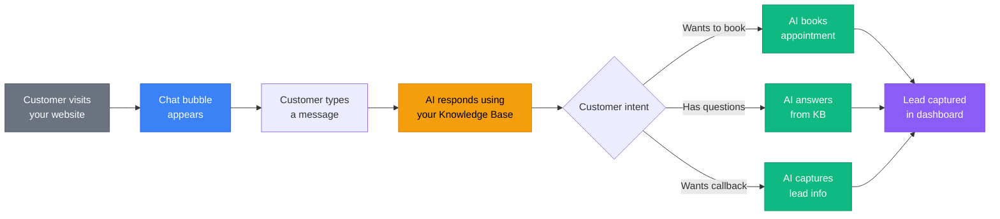

<Note>
**Set up your chat widget:** [Open Chat Widget Settings](https://app.closethecall.com/chat-widget)
</Note>

The Chat Widget puts your AI receptionist on your website as a text chat bubble. Visitors can ask questions, book appointments, and become leads — all without picking up the phone. It uses the same AI, same knowledge base, and same booking logic as your phone receptionist.

## How It Works



## Setup Wizard

Setting up the chat widget takes about 2 minutes. The wizard in your dashboard walks you through three steps.

### Step 1: Customise

<Steps>
  <Step title="Go to Chat Widget">
    Navigate to **Chat Widget** in the sidebar, or go directly to [app.closethecall.com/chat-widget](https://app.closethecall.com/chat-widget).
  </Step>
  <Step title="Enable the widget">
    Toggle the chat widget **ON**.
  </Step>
  <Step title="Set your colours">
    Choose a primary colour that matches your website branding. This colours the chat bubble, header bar, and send button.
  </Step>
  <Step title="Set the welcome message">
    This is the first message visitors see when they open the chat. Example: *"Hi! I'm the AI assistant for Acme Plumbing. How can I help you today?"*
  </Step>
  <Step title="Choose bubble position">
    Pick **bottom-right** (default and most common) or **bottom-left** for where the chat bubble appears on your site.
  </Step>
</Steps>

### Step 2: Allowed Domains

Add the domains where the widget should work. This prevents anyone from embedding your chat widget on unauthorised sites.

- Enter your website domain (e.g., `acmeplumbing.co.uk`)
- Add any additional domains (e.g., `www.acmeplumbing.co.uk`)
- The widget will only load on these domains

<Warning>
If you don't add any domains, the widget will work on any website. We strongly recommend restricting it to your own domains.
</Warning>

### Step 3: Install

Copy and paste a single line of code into your website, just before the closing `</body>` tag:

```html
<script src="https://api.closethecall.com/widget/{your-token}/embed.js"></script>
```

Your unique token is shown on the Install step in your dashboard. If you use a website builder like WordPress, Wix, or Squarespace, paste this into the custom code / footer injection section.

<Info>
The embed script is lightweight (under 15KB) and loads asynchronously — it will not slow down your website. It renders a small chat bubble in the corner that expands when clicked.
</Info>

## Customisation Options

| Option | Description | Default |
|--------|-------------|---------|
| **Primary Colour** | Hex colour for bubble, header, and buttons | `#1A56DB` (blue) |
| **Welcome Message** | First message shown when chat opens | "Hi! How can I help you today?" |
| **Position** | Bottom-right or bottom-left corner | Bottom-right |
| **Widget Title** | Text shown in the chat header bar | Your business name |

## What the Chat AI Can Do

The chat widget AI has the same capabilities as your phone AI:

- **Answer questions** from your Knowledge Base (services, pricing, hours, FAQs)
- **Book appointments** by checking your calendar availability
- **Capture leads** by collecting name, email, and phone number
- **Request callbacks** when the visitor prefers a phone call

All leads and appointments created through the chat widget appear in your regular **Leads** and **Appointments** pages, marked as coming from the **WEBCHAT** channel.

## Chat Conversations

All chat conversations are saved and visible in your **Conversations** page. They appear alongside SMS and WhatsApp conversations, with a **Web Chat** badge to distinguish them. You can take over any conversation manually if the AI needs help.

---

## Frequently Asked Questions

<Accordion title="Does the widget slow down my website?">
  No. The embed script is under 15KB, loads asynchronously, and does not block page rendering. It has zero impact on your Core Web Vitals or page load speed. The chat bubble only renders after your page has fully loaded.
</Accordion>

<Accordion title="Can I restrict which domains the widget works on?">
  Yes. In **Step 2** of the setup wizard, add your allowed domains. The widget will refuse to load on any domain not in your list. This prevents unauthorised use if someone copies your embed code.
</Accordion>

<Accordion title="Does the chat widget work on mobile?">
  Yes. The widget is fully responsive. On mobile, the chat bubble appears in the corner and expands to a full-screen or near-full-screen chat panel when tapped. It works on iOS Safari, Android Chrome, and all modern mobile browsers.
</Accordion>

<Accordion title="Is the chat AI the same as my phone AI?">
  Yes. The chat widget uses the same Knowledge Base, the same booking logic, and the same lead capture as your phone receptionist. Any changes you make to your Knowledge Base or Receptionist Settings are immediately reflected in both phone and chat. You maintain one AI brain, not two.
</Accordion>

<Accordion title="Can visitors upload files or images in the chat?">
  Not currently. The chat supports text messages only. If a visitor needs to send photos (e.g., of a plumbing issue), the AI can capture their contact details and you can follow up via email or SMS.
</Accordion>

<Accordion title="How do I remove the widget from my site?">
  Simply remove the `<script>` tag from your website, or toggle the widget **OFF** in your dashboard. When disabled, the embed script still loads but does not render anything — no chat bubble will appear.
</Accordion>
