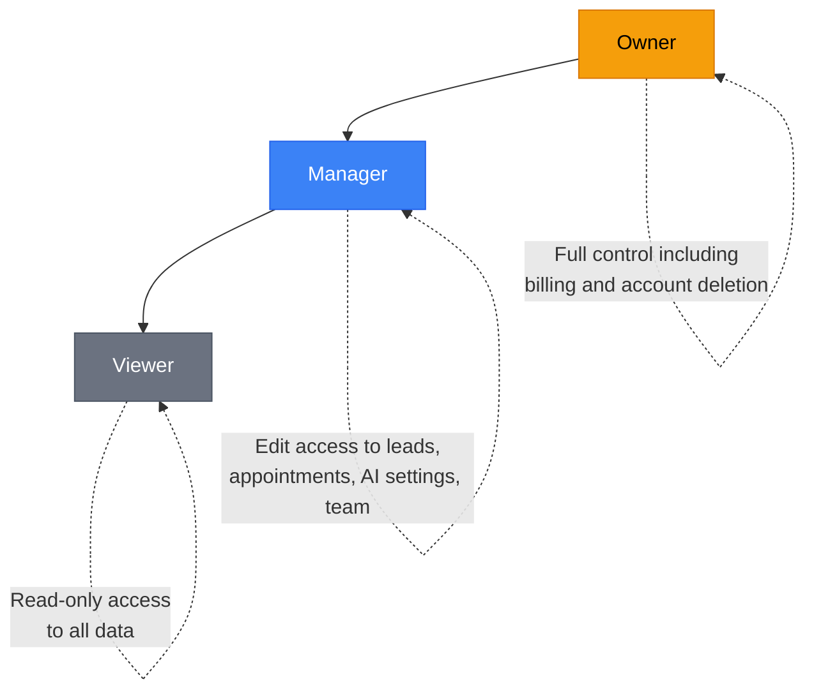

<Note>
**Manage your team:** [Open Team Settings](https://app.closethecall.com/account)
</Note>

If you have staff, a business partner, or a virtual assistant who needs access to your dashboard, you can invite them as team members. Each person gets their own login and sees only what their role allows.

## Role Hierarchy

Your dashboard has three roles for business users. The Admin role exists only for CloseTheCall platform staff and is not available to customers.

## The Three Roles

| Role | What They Can Do | Best For |
|------|-----------------|----------|
| **Owner** | Everything. Full access to all features, billing, settings, and team management. | You — the business owner. |
| **Manager** | Everything except billing and account deletion. Can manage leads, appointments, AI settings, and team. | Office manager, senior staff, or business partner. |
| **Viewer** | Read-only access. Can see calls, leads, appointments, and analytics but cannot change anything. | Part-time staff, accountant, or anyone who needs visibility without control. |

<Info>
There's always exactly one Owner. You can't transfer ownership through the dashboard — contact support if you need to change the account owner. The **Admin** role is reserved for CloseTheCall platform administrators and is not assignable to business team members.
</Info>

## Inviting Team Members

<Steps>
  <Step title="Go to Team Management">
    Click **Settings > Team** in the sidebar. Or navigate directly to the Team page.
  </Step>
  <Step title="Click Invite Member">
    Click the **+ Invite Member** button at the top right.
  </Step>
  <Step title="Enter their email">
    Type the email address of the person you want to invite.
  </Step>
  <Step title="Choose a role">
    Select **Manager** or **Viewer** from the dropdown. (You can change this later.)
  </Step>
  <Step title="Send the invite">
    Click **Send Invite**. They'll receive an email with a link to create their account and set a password.
  </Step>
</Steps>

<Tip>
The invite email is valid for 7 days. If they don't accept in time, you can resend it from the pending invites section.
</Tip>

## Pending Invites

After sending an invite, it appears in the **Pending Invites** section at the bottom of the Team page. From here you can:

- **Resend** — Send the invite email again (useful if it went to spam).
- **Cancel** — Revoke the invite before it's accepted.

Once the person accepts the invite and creates their account, they move from Pending Invites to the Active Members list.

## Changing Roles

<Steps>
  <Step title="Find the team member">
    On the Team page, find the person whose role you want to change.
  </Step>
  <Step title="Click the role dropdown">
    Next to their name, click the current role badge. A dropdown appears.
  </Step>
  <Step title="Select the new role">
    Choose **Manager** or **Viewer**. The change takes effect immediately.
  </Step>
</Steps>

<Warning>
Changing someone from Manager to Viewer immediately removes their ability to edit anything. They will see the change on their next page load.
</Warning>

## Removing Team Members

<Steps>
  <Step title="Find the team member">
    On the Team page, find the person you want to remove.
  </Step>
  <Step title="Click Remove">
    Click the **Remove** button (or the three-dot menu, then **Remove**).
  </Step>
  <Step title="Confirm">
    Click **Yes, remove** in the confirmation dialog. Their access is revoked immediately.
  </Step>
</Steps>

After removal:

- Their active sessions are terminated immediately.
- They cannot log back in.
- Their past activity (any changes they made) is preserved in your history.
- They do **not** receive a notification that they were removed.

## What Each Role Can Access

| Feature | Owner | Manager | Viewer |
|---------|:-----:|:-------:|:------:|
| View calls, leads, appointments | Yes | Yes | Yes |
| View analytics and reports | Yes | Yes | Yes |
| Create/edit leads and appointments | Yes | Yes | No |
| Change AI settings | Yes | Yes | No |
| Manage integrations | Yes | Yes | No |
| Manage knowledge base | Yes | Yes | No |
| Send SMS/email to leads | Yes | Yes | No |
| Manage team members | Yes | Yes | No |
| View and change billing | Yes | No | No |
| Change account settings | Yes | No | No |
| Delete account | Yes | No | No |

---

## Frequently Asked Questions

<Accordion title="Can I transfer ownership to someone else?">
  Ownership transfer is not available as a self-service feature. Contact support at [support@closethecall.com](mailto:support@closethecall.com) with the current owner's email and the new owner's email. Both parties will need to confirm the transfer via email for security purposes.
</Accordion>

<Accordion title="Is there a team member limit?">
  No. There is no limit on any plan. Add as many team members as you need — team member accounts are completely free.
</Accordion>

<Accordion title="Can team members see billing information?">
  No. Only the **Owner** role can view and manage billing, including subscription plans, invoices, and payment methods. Managers and Viewers do not have access to any billing pages or data.
</Accordion>

<Accordion title="What happens when I remove a team member?">
  Their access is revoked instantly. All active sessions are terminated, so they are logged out immediately on every device. They cannot log back in. However, any changes they previously made (edits to leads, appointments, settings) are preserved in your account history. They do not receive a notification about the removal.
</Accordion>

<Accordion title="Can a team member have access to multiple businesses?">
  Currently, each team member invitation is tied to one business. If you manage multiple businesses, you'll need to invite them separately to each one.
</Accordion>

<Accordion title="What if a team member forgets their password?">
  They can use the **Forgot Password** link on the login page. A reset email will be sent to the address they signed up with.
</Accordion>
