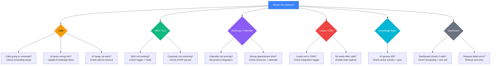

<Note>
**Need help?** [Open Support](https://app.closethecall.com/support) to submit a ticket directly from your dashboard.
</Note>

## Diagnostic Decision Tree

Use this diagram to quickly identify which section to jump to based on your issue type.

## Quick Fix Table

| Problem | Likely Cause | Solution |
|---------|-------------|----------|
| AI gives wrong prices | Pricing not in Knowledge Base | Go to **Knowledge Base** → add PRICING articles with your rates |
| AI says "I don't know" to a question | Missing knowledge for that topic | Check which **Knowledge Base category** is empty → add articles |
| Calls aren't being forwarded | Carrier forwarding not set up | Follow the **Call Forwarding** guide for your specific carrier |
| "Request failed" error toast | Temporary server issue | Wait 30 seconds and refresh. If persistent, contact support. |
| AI hangs up too early | Silence timeout too short | Go to **Receptionist Settings** → increase silence re-engagement timeout |
| No leads appearing after calls | Lead capture is disabled | Go to **Receptionist Settings** → enable **"Capture Lead Info"** |
| No appointments appearing | Booking is disabled | Go to **Receptionist Settings** → enable **"Book Appointments"** |
| Customer got wrong appointment time | Calendar not synced | Connect **Google Calendar** in Integrations → AI checks your availability |
| AI doesn't know my business hours | Hours not in Knowledge Base | Go to **Knowledge Base** → add HOURS article, or **My Business** → set hours |
| Dashboard shows 0 calls | Forwarding not working or no calls yet | Call your AI number directly to test. Check forwarding setup. |
| Conversations page is empty | SMS auto-reply is off | Toggle **"SMS Auto-Reply"** ON in the Conversations page header |

---

## SMS Not Sending

If your AI is not sending SMS confirmations or follow-up texts, work through these steps in order:

<Steps>
  <Step title="Check the SMS toggle">
    Go to **Receptionist Settings** and make sure the SMS-related toggles are enabled. Also check the **Conversations** page header — the **SMS Auto-Reply** toggle must be ON.
  </Step>
  <Step title="Check if the customer opted out">
    If a customer previously texted **STOP**, **CANCEL**, or **UNSUBSCRIBE** to your number, they are opted out and will not receive any further texts. They can text **START** to re-subscribe.
  </Step>
  <Step title="Verify Twilio number configuration">
    Your phone number needs an active SmsUrl configured on Twilio. If you provisioned your number recently and SMS still isn't working, contact support — we can check your Twilio number setup.
  </Step>
  <Step title="Contact support">
    If all the above look correct, [submit a support ticket](https://app.closethecall.com/support) with your business name and the phone number that isn't receiving texts.
  </Step>
</Steps>

---

## Calendar Not Syncing

If appointments booked by your AI are not appearing in your Google or Outlook calendar:

<Steps>
  <Step title="Check your integration status">
    Go to **Integrations** in the sidebar. Find Google Calendar or Outlook Calendar and check whether the status shows **Connected** (green).
  </Step>
  <Step title="Reconnect if expired">
    Calendar tokens expire periodically. If the status shows **Disconnected** or **Expired**, click **Reconnect** and go through the OAuth flow again. This refreshes the token.
  </Step>
  <Step title="Verify the correct calendar is selected">
    After connecting, make sure you selected the right calendar (some people have multiple Google calendars). The AI books into whichever calendar was chosen during setup.
  </Step>
  <Step title="Test with a new booking">
    Call your AI number and book a test appointment. Check your calendar within 60 seconds — the event should appear. If it doesn't, the sync may be blocked by your calendar provider.
  </Step>
</Steps>

<Info>
Calendar sync happens immediately when the AI books an appointment. There is no delay or batch process. If appointments are missing, the integration token has almost certainly expired.
</Info>

---

## CRM Leads Not Appearing

If leads captured by your AI are not showing up in HubSpot, Salesforce, or GoHighLevel:

<Steps>
  <Step title="Check the integration toggle">
    Go to **Integrations** and verify your CRM integration is **Connected** and **Enabled**. Some integrations have a separate enable/disable toggle.
  </Step>
  <Step title="Verify your API key">
    CRM integrations require a valid API key. If you recently rotated your CRM API key, you need to update it in CloseTheCall. Go to **Integrations** → your CRM → update the API key.
  </Step>
  <Step title="Check field mapping">
    Leads are synced with standard fields (name, email, phone, service requested). If your CRM has required custom fields that aren't being filled, the sync may silently fail. Check your CRM's API logs for rejected records.
  </Step>
  <Step title="Check for duplicates">
    Some CRMs (especially HubSpot) merge duplicate contacts automatically. Your lead may have been created but merged with an existing contact. Search your CRM by phone number.
  </Step>
</Steps>

---

## Knowledge Base Not Being Used by AI

If you've added articles to your Knowledge Base but the AI still says "I don't know" or gives wrong answers:

<Steps>
  <Step title="Check that articles are active">
    Go to **Knowledge Base** and make sure your articles are published and not in draft. Only active, non-deleted articles are included in the AI's knowledge.
  </Step>
  <Step title="Check your intelligence score">
    On the **My Business** page, look at your **Intelligence Score**. If it's below 60%, you likely have gaps in critical categories like SERVICES, PRICING, or HOURS that the AI needs.
  </Step>
  <Step title="Re-sync to VAPI">
    After adding or editing articles, the system automatically syncs your knowledge to the AI. If you suspect the sync didn't happen, go to **Knowledge Base** and click **Re-scan Website** — this triggers a full rebuild of the AI's knowledge.
  </Step>
  <Step title="Test with a specific question">
    Call your AI number and ask the exact question that was previously unanswered. The AI should now reference the new article. If it doesn't, the article content may need to be more specific — write it as a direct answer to common customer questions.
  </Step>
</Steps>

<Tip>
The AI prioritises articles with higher confidence scores. If you've manually verified an article, click **Verify** to boost its priority in the AI's responses.
</Tip>

---

## Calls Going to Voicemail Instead of AI

If calls to your business number are hitting your personal voicemail instead of being answered by the AI:

<Steps>
  <Step title="Verify call forwarding is active">
    The most common cause is that call forwarding from your carrier to your AI number was never set up, or it was accidentally turned off. Go to **Phone** in your dashboard and follow the carrier-specific instructions for your provider (EE, O2, Vodafone, AT&T, etc.).
  </Step>
  <Step title="Check your AI number is active">
    In the **Phone** page, verify that your AI number shows a green **Active** status. If it shows inactive, contact support.
  </Step>
  <Step title="Check forwarding type">
    Make sure you set up **"Forward when unanswered"** (recommended), not "Forward all calls". With unanswered forwarding, your phone rings first and then forwards to the AI if you don't pick up. If the ring time is too short, increase it in your carrier settings.
  </Step>
  <Step title="Test the AI number directly">
    Call your AI number directly (not your business number). If the AI answers, your AI is working fine and the issue is with carrier forwarding. If the AI doesn't answer, contact support.
  </Step>
</Steps>

---

## Still Stuck?

<CardGroup cols={2}>
  <Card title="Contact Support" icon="headset" href="https://app.closethecall.com/support">
    Submit a support ticket from your dashboard
  </Card>
  <Card title="WhatsApp Us" icon="whatsapp" href="https://wa.me/447450307109">
    Chat with us directly on WhatsApp
  </Card>
</CardGroup>

<Warning>
When contacting support, please include:
- Your business name
- What you were trying to do
- What error message you saw (screenshot helps!)
- Your browser (Chrome, Safari, etc.)
</Warning>

---

## Frequently Asked Questions

<Accordion title="Why does my AI say it booked an appointment but nothing shows on my calendar?">
  This almost always means your Google Calendar or Outlook integration token has expired. Go to **Integrations**, disconnect your calendar, and reconnect it. The appointment may still be recorded in your **Appointments** page even if the calendar sync failed — check there first.
</Accordion>

<Accordion title="Why is the AI giving outdated information about my business?">
  The AI uses your **Knowledge Base** articles. If you changed your prices, hours, or services but didn't update the Knowledge Base, the AI will still use the old information. Go to **Knowledge Base**, find the outdated article, and edit it. Changes sync to the AI within seconds.
</Accordion>

<Accordion title="My customers say they can't reach me at all — what's wrong?">
  This is usually a carrier forwarding issue. Test by calling your business number from a different phone. If it goes straight to voicemail, your forwarding is off. Follow the carrier instructions on the **Phone** page. If you hear the AI answer, the issue may be with a specific caller's network — ask them to try again.
</Accordion>

<Accordion title="Why are some calls showing 0 seconds duration?">
  A 0-second call means the caller hung up before the AI could answer, or there was a network error on the carrier side. This is normal for a small percentage of calls (1-3%). If you see a high number of 0-second calls, check that your AI number is active and responding.
</Accordion>

<Accordion title="The AI is speaking in a different language — how do I fix it?">
  Go to **Receptionist Settings** and check the **Language** section. If you have a secondary language enabled (bilingual mode), the AI will switch languages when it detects the caller is speaking another language. To disable this, remove the secondary language selection.
</Accordion>

<Accordion title="My SMS conversations page is empty even though I enabled SMS">
  Make sure the **SMS Auto-Reply** toggle is ON at the top of the **Conversations** page. Also verify that your phone number has SMS capability — go to the **Phone** page and check that your number type supports SMS. UK landlines do not support SMS; you need a mobile number for two-way text messaging.
</Accordion>

<Accordion title="Why am I getting duplicate leads?">
  The AI creates a new lead each time a caller provides their details. If the same person calls twice and gives their info both times, you'll see two lead entries. You can merge them manually from the **Leads** page. The AI does attempt to match returning callers by phone number, but if they call from a different number, a new lead is created.
</Accordion>

<Accordion title="How do I reset my AI to default settings?">
  There's no one-click reset button. However, you can go to **Receptionist Settings** and manually revert the greeting, personality, and other settings. For the Knowledge Base, you can click **Re-scan Website** on the Knowledge Base page to re-crawl your website and regenerate articles from scratch.
</Accordion>
